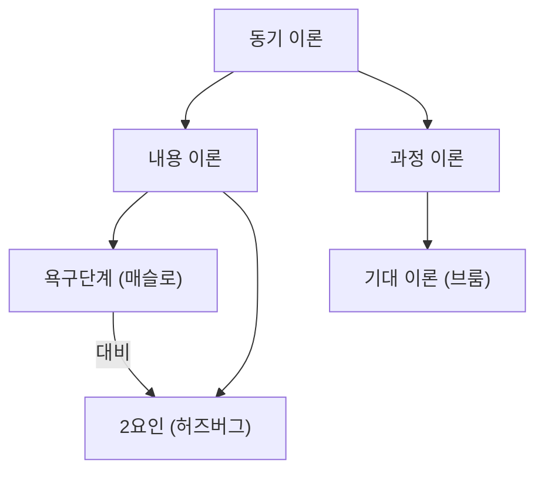

# 학습 노트 양식 기획안 v1 — 대학 문과·경영 강의

- 상태: 초안 · 검토 대기
- 작성일: 2026-10-02
- 목적: 이 문서를 근거로 노트 생성 프롬프트와 출력 스키마, Markdown 배치 코드를 다시 설계한다.
- 참고 교재: 「[2027] IMFACT 사회와 문화 맛보기 교안」(28쪽, 이하 IMFACT), 「[생윤] 2027 LIMIT 맛보기교재」(10쪽, 이하 LIMIT)
- 관련 코드: `lib/openrouter-client.js`(프롬프트·스키마, 서버도 같은 파일을 씀), `lib/summary.js`(검증·합성), `sidepanel.js` `noteText`(JSON → Markdown 배치), `sandbox.html`(렌더러), `landing/product-panel.css`(노트 타이포그래피)

### 규칙 표기

| 표기 | 뜻 |
|---|---|
| **[필수]** | 어기면 노트 결함. 프롬프트에 반드시 들어가거나 코드가 강제한다. |
| **[권장]** | 기본값. 내용이 맞지 않으면 벗어날 수 있다. |
| **[조건]** | 정해진 조건일 때만 생성한다. 조건이 아니면 블록 자체를 만들지 않는다. |

### 문서 구성

1. 배경과 목표
2. 설계 원칙
3. 두 교재에서 가져올 것과 고칠 것
4. 노트 전체 구성
5. 블록별 상세 명세
6. 개념 설명 방법
7. 디자인 (표현 규칙)
8. 상황별 대응
9. 분량 예산
10. 생성 파이프라인 연결
11. 프롬프트 작성 가이드
12. 품질 검수 기준
13. 완성 예시
14. 결정 사항

---

## 1. 배경과 목표

### 1.1 현재 노트의 모양과 한계

현재 노트는 다음 순서로 나온다.

1. 핵심 결론
2. 강의 시간 순 섹션. 개념·정정·수식·도식이 근거 시각에 따라 각 섹션 아래 붙는다.
3. 복습 질문 체크리스트

이공계 강의의 흐름을 따라가기에는 맞지만, 문과·경영 강의에서는 다섯 가지가 비어 있다.

- 개념이 한 줄 항목으로만 나온다. 비교, 분류, 이론의 전제와 귀결, 논증 구조가 드러나지 않는다.
- 같은 층위의 개념이 서로 다른 모양으로 정리된다. 예를 들어 한 이론은 '정의·한계'로, 다른 이론은 '특징'만으로 정리돼 나란히 비교할 수 없다.
- 복습 질문이 열린 질문뿐이다. 학생이 스스로 맞았는지 확인할 정답과 해설이 없다.
- 시험 범위나 과제 마감처럼 학생에게 가장 실용적인 정보를 둘 자리가 없다.
- 중요도(critical)가 "시험에 나올 법한 것"이라는 모델 추정에만 기댄다. "시험에 나와요" 같은 교수의 실제 강조 신호를 따로 다루지 않는다.

### 1.2 목표

1. 문과·경영 강의의 내용 구조(비교, 분류, 이론, 논증, 사례, 제도, 수치)가 노트 모양에 그대로 드러난다.
2. 한 문서 안에서 **이해(읽기) → 굳히기(시험 문장) → 인출(자기 점검)** 까지 끝난다.
3. 어떤 강의, 어떤 입력 조건에서도 골격은 같다. 블록은 내용에 맞는 것만 나온다.
4. 사이드패널, PDF, 노션 붙여넣기, 다크 모드 어디서 열어도 위계가 같다.

### 1.3 비목표

- 문제집 대체. 대량 기출형 문항은 만들지 않는다.
- 강의 원문 재현. 저장소 불변 조건 "Non-substitutive"를 따른다.
- 렌더러 대개편. 현재 Markdown 경로 안에서 해결한다. 렌더러 확장은 §7.9에 선택 사항으로만 둔다.
- 이공계 전용 양식. 수식 블록은 유지하지만 이 문서의 판단 기준은 문과·경영 강의다.

### 1.4 성공 기준

| 기준 | 측정 |
|---|---|
| 검수 체크리스트(§12.1) 자동 항목 | 테스트 세트(§12.2) 전 건 통과 |
| 비교 가능한 개념쌍이 있는 단원 | 비교 구조(비교표 또는 관계 명제) 누락 0건 |
| 자기 점검 | 모든 문항에 정답, 모든 X 문항에 이유 1줄 |
| 분량 | 강의 길이별 예산(§9) 범위 안 |
| 근거 | 모든 항목이 유효한 근거 ID를 가짐 (현행 검증 유지) |
| 학생 평가 | 문과·경영 수강생 5명 이상이 "이 노트만으로 복습·시험 준비가 된다"에 5점 척도 4 이상 |

---

## 2. 설계 원칙

모든 규칙은 이 12개 원칙에서 나온다. 프롬프트에서 규칙끼리 부딪히면 이 원칙으로 판정한다.

| # | 원칙 | 뜻 | 출처 |
|---|---|---|---|
| 1 | **읽기와 인출을 분리한다** | 본문은 완성된 문장으로 쓴다. 빈칸과 OX는 노트 끝 '자기 점검'에 모으고, 정답은 그보다 뒤에 둔다. | 본문 방식은 LIMIT, 인출 방식은 IMFACT. IMFACT의 빈칸 본문은 첫 읽기에 정보가 없다는 약점을 고친 것 |
| 2 | **비교가 기본 단위다** | 개념을 혼자 정의하지 않고 짝이나 묶음 안에서 정의한다. 시험과 토론이 "A와 달리 B는"으로 묻기 때문이다. | 두 교재 공통 |
| 3 | **같은 유형의 개념은 같은 칸으로** | 이론은 이론끼리, 제도는 제도끼리 같은 슬롯과 같은 순서를 쓴다. 세로로 읽으면 설명이 되고, 가로로 읽으면 비교가 된다. | 두 교재 공통 |
| 4 | **관계는 세 문법으로** | 차이("A와 달리 B는"), 공통("A와 B 모두"), 정도("A는 B보다")를 구분해 쓴다. | IMFACT 심화체크 |
| 5 | **뼈대는 강의 순서, 단원 안은 논리 순서** | 단원은 강의 시간 순이라 다시 들을 위치를 바로 찾을 수 있다. 단원 안은 개념 → 구조 → 명제 → 함정 → 적용 순서로 고정한다. | 강의 순서는 제품 고유, 단원 내부 순서는 IMFACT 레벨 순서 |
| 6 | **중요도는 강의 신호로, 강조는 드물게** | 교수의 직접 언급 > 반복 > 슬라이드 구조 순으로 판정한다. 형광펜과 ⭐에는 개수 상한을 둔다. | 수능 교재의 약점(출제 축 전제)을 보완 |
| 7 | **근거 없는 내용은 쓰지 않고, 보탠 것은 표시한다** | 강의 밖 지식은 정해진 자리에서만, `(강의 외)` 표시와 함께 쓴다. | 제품 불변 조건 |
| 8 | **내용이 없으면 블록도 없다** | 조건부 블록은 조건을 채울 때만 나온다. 빈 제목이나 "해당 없음"은 쓰지 않는다. | — |
| 9 | **내용은 모델이, 배치는 코드가** | 단원 번호, 시간 범위, 블록 제목, 순서, 형광펜 마크업, 정답 조립, 개수 상한은 코드가 정한다. 모델은 내용만 쓴다. | 작은 모델의 형식 오류를 구조적으로 막기 위함 |
| 10 | **어디서 열어도 같은 위계** | GFM Markdown, `==형광펜==`, `$수식$`, mermaid만 쓴다. HTML 태그는 쓰지 않는다. | 출력 경로가 사이드패널·PDF·노션 세 가지 |
| 11 | **암기와 논증을 함께** | 용어·OX 같은 확인 문항에 더해, 대학 시험의 서술형에 맞춘 답안 뼈대를 준다. | 수능 교재의 약점(암기형만)을 보완 |
| 12 | **한 번만 쓴다** | 같은 사실을 두 블록에 쓰지 않는다. 예외는 핵심 명제뿐이고, 그것도 관계·조건·정도를 더할 때만 허용한다(§5.7.6). | 현행 프롬프트 "One item per idea" 유지 |

---

## 3. 두 교재에서 가져올 것과 고칠 것

### 3.1 가져올 것

| # | 장점 | 출처 | 이 양식에서 반영한 곳 |
|---|---|---|---|
| 1 | 개념마다 같은 칸 (LIMIT: 의미·성격·탐구 과제·관계·한계 / IMFACT: 전제·입장·사회화·원인·한계) | 둘 다 | §6.2 유형별 슬롯 템플릿 |
| 2 | 2열 비교표, 공통점은 별도 칸 | LIMIT | §5.7.5 비교표의 '공통점' 줄 |
| 3 | 번호를 맞춘 대립쌍 목록 | IMFACT | §5.7.5 비교표 (행 = 비교 기준) |
| 4 | 시험 문장으로 다시 쓴 명제 목록 ("모두 / 달리 / 비해") | IMFACT 심화체크 | §5.7.6 핵심 명제 |
| 5 | [주의] 함정 경고 | IMFACT | §5.7.7 헷갈리기 쉬운 점 |
| 6 | 추상적 특징 바로 옆의 (예) | LIMIT | §6.2 슬롯의 `예)` |
| 7 | 질문 형태로 보여 주는 예 ("관심을 가지는 문제들") | LIMIT | §5.3 이 강의의 질문, §5.7.5 판별 질문 |
| 8 | Check it 보조 칸 (본문과 맥락의 분리) | LIMIT | §5.7.9 보충 |
| 9 | 원문 인용 → '분석' 박스 | LIMIT 심화 자료 | §6.2 원전·자료형 슬롯 (출처·요지·해석) |
| 10 | Point 태그 사례 ↔ 해설 1:1 대응 | IMFACT Level 2 | §5.7.8 사례로 적용 |
| 11 | 경계 사례의 판별 기준 명시 | IMFACT Level 2 | §5.7.8의 '판별 기준' 줄 |
| 12 | 판별 질문 (예/아니요로 가르는 질문, 구분 못 하는 질문) | IMFACT | §5.7.5 판별 질문 |
| 13 | 전제 → 입장 → 귀결을 화살표로 이은 사슬 | IMFACT | §6.6 |
| 14 | 한계 슬롯 | 둘 다 | §6.6 한계를 다음 개념으로 잇는 다리 |
| 15 | 공통점 섹션 | 둘 다 | 비교표 공통점 줄, 핵심 명제의 공통 문법 |
| 16 | 첫 소주제가 과목 지도 역할 | LIMIT | §5.5 강의 지도 |
| 17 | 빈칸 인출과 정답 분리 | IMFACT | §5.10 용어 인출, §5.11 정답과 해설 |
| 18 | 다양한 인출 형식 | IMFACT Level 3 | §5.10 자기 점검 3형식 |
| 19 | OX 오답 설계 원리 (속성 바꿔치기 등) | 둘 다 | §5.10.2 오답 6유형 |
| 20 | 판별 키워드만 굵게 | LIMIT | §7.3 강조 문법 |
| 21 | 색 위계 (이름표 / 핵심 구절 / 결론 명제 / 용어 풀이) | IMFACT | §7.3 Markdown 4단 강조 |
| 22 | 문체로 레이어를 표시 (개조식 vs 서술형) | LIMIT | §6.8 문체 규칙 |
| 23 | 고정 단계 순서 | IMFACT | §4.1 단원 내부 고정 순서 |
| 24 | 현재 위치 표시 (러닝 헤더) | IMFACT | §5.7.2 단원 번호와 시간 범위 |

### 3.2 고칠 것

| # | 약점 | 어디서 | 대학 강의에서 문제가 되는 이유 | 보완 |
|---|---|---|---|---|
| 1 | 출제 기준을 저자가 안다고 전제함 | 둘 다 | 교수마다 시험이 다르다 | 강의 신호 기반 중요도(§6.9), `(교수 강조)` 표시 |
| 2 | 정답만 있고 해설이 없음 | LIMIT 기출, IMFACT Level 5·OX | 틀린 이유를 모르면 학습이 안 된다 | 모든 X에 이유 1줄과 참조 단원 |
| 3 | 본문이 빈칸이라 첫 읽기에 정보가 없음 | IMFACT Level 1 | 강의 직후 복습용 노트는 먼저 읽혀야 한다 | 본문은 완성형, 빈칸은 자기 점검에만 |
| 4 | 분량 고정·과다 (주제마다 OX 20개) | 둘 다 | 강의 길이가 제각각이고 출력 토큰에 상한이 있다 | 길이별 예산(§9) |
| 5 | 개념 전체 구조를 그림으로 보여 주지 않음 | LIMIT (윤리학 4분류 도식 없음) | 대학 강의는 개념 수가 많다 | 강의 지도(§5.5), 단원 간 종합(§5.8) |
| 6 | 출처·위치 추적이 없음 | 둘 다 | 다시 들을 위치와 신뢰가 필요하다 | 단원 시간 범위, 항목별 근거 ID |
| 7 | 컬러 인쇄를 전제함 | 둘 다 | 사이드패널·다크 모드·흑백 인쇄·노션 | Markdown 위계만으로 구분(§7) |
| 8 | 암기형 문항뿐 | 둘 다 | 대학은 서술·논술·리포트 비중이 크다 | 서술형과 답안 뼈대(§5.10.3) |
| 9 | 모든 내용을 확정적으로 서술함 | 둘 다 | 음성 인식 오류와 녹화 끊김이 있다 | 정정·불확실 블록, `(인식 불확실)` 표시 |
| 10 | 교수 해석과 통설을 구분하지 않음 | — (수능은 통설만) | 대학 강의는 교수의 관점이 핵심일 때가 많다 | `(교수 해석)` 표시 |
| 11 | 원어·학자 정보 부족 | IMFACT | 원서와 논문을 읽어야 하고, 영어 강의가 있다 | 용어(원어) 병기, 헤딩에 학자·연도 |
| 12 | 정량 내용 블록이 없음 | 둘 다 | 경제·재무·회계 과목 | 수식, 그래프 읽기, 계산 예 블록 |
| 13 | 심화 자료가 개념과 다른 쪽에 있음 | LIMIT | 앞뒤로 오가야 한다 | 같은 단원 안에 배치 |
| 14 | 시험·과제 정보를 둘 자리가 없음 | — (교재라 해당 없음) | 학생에게 가장 실용적인 정보다 | 강의 공지 블록(§5.6) |
| 15 | 사례가 시험용 짧은 지문뿐 | IMFACT | 경영은 케이스가 수업의 본체다 | 사례형 슬롯(상황·쟁점·결정·결과·교훈) |

---

## 4. 노트 전체 구성

### 4.1 레이어

```
[머리]    제목 · 시스템 안내
[한눈에]  이 강의의 질문 · 핵심 결론 · 강의 지도 · 강의 공지
[본문]    단원 01 … 단원 N   (강의 시간 순)
            └ 단원 헤더 → 요지 → 개념·구조(강의 순) → 핵심 명제
              → 헷갈리기 쉬운 점 → 사례로 적용 → 보충 → 정정·불확실
[종합]    단원 간 종합 · 남은 질문
[점검]    자기 점검 (용어 인출 · OX · 서술형)
[정답]    정답과 해설
```

같은 노트를 세 가지 방식으로 읽을 수 있다.

| 읽는 방식 | 읽는 곳 | 시간 |
|---|---|---|
| 5분 복습 | [한눈에] | 강의 직후, 다음 수업 직전 |
| 시험 공부 | 각 단원의 핵심 명제·헷갈리기 쉬운 점 + [점검] → [정답] | 시험 기간 |
| 다시 듣기 | 단원 헤더의 시간 범위 | 이해가 안 될 때 |

### 4.2 Markdown 골격

굵은 대괄호 `【 】` 안은 설명이다. 그 밖의 고정 문자열(헤딩 이름, 라벨)은 **코드가 출력**하고, 모델은 쓰지 않는다.

````markdown
# 【제목】
> ⚠ 【시스템 안내 — 끊김·누락이 있을 때만, 현행 유지】

## 한눈에 보기

이 강의의 질문 — 【질문 1문장】

### 핵심 결론
> **【결론 1줄】**
>
> 【설명 2~3문장】

### 강의 지도
【mermaid — 조건부】

### 강의 공지
- 【종류】: 【내용】 (강의 mm:ss)

## 01 【단원 제목】 ⭐
강의 mm:ss–mm:ss

【요지 1~2문장】

### 【개념명 (원어)】
- 【슬롯 라벨】: 【내용】
- 예) 【예】

### 【구조 블록 제목】
【표 / 목록 / mermaid / 수식】

### 핵심 명제
1. 【관계 명제】

### 헷갈리기 쉬운 점
- 【착각】지만, 【실제】

### 사례로 적용 · 【사례명】
상황: 【1~2문장】
- ① 【단서】 → 【개념】: 【이유】
- 판별 기준: 【1줄】

### 보충
- 【원어·학자·배경】

### 정정·불확실
- 정정: 【…】

## 단원 간 종합
## 남은 질문
## 자기 점검
### 용어 인출
### OX
### 서술형
## 정답과 해설
````

### 4.3 블록 목록

'단계'는 그 블록을 만드는 생성 단계다. 단계 구분은 §10.2에 있다.

- **청크**: 강의 일부를 받는 단계
- **최종**: 합성 단계, 또는 청크가 하나뿐인 강의의 유일한 단계
- **코드**: 모델이 아니라 코드가 만든다

| ID | 블록 | 종류 | 생성 조건 | 분량 | 단계 |
|---|---|---|---|---|---|
| N1 | 제목 | 고정 | 항상 | 1줄, 40자 이하 | 청크·최종 |
| N2 | 시스템 안내 | 조건 | 끊김·누락·미인용 근거가 있을 때 (현행) | — | 코드 |
| N3 | 이 강의의 질문 | 고정 | 항상 | 1문장, 50자 이하 | 최종 |
| N4 | 핵심 결론 | 고정 | 항상 | §9 예산 | 청크(후보)·최종(확정) |
| N5 | 강의 지도 | 조건 | 단원 3개 이상이면서 단원 사이에 대비·포함·발전·비판 관계가 있을 때, 또는 분류 체계가 강의의 중심일 때 | 노드 12개 이하 | 최종 |
| N6 | 강의 공지 | 조건 | 시험·과제·일정·평가 언급이 있을 때 | 6개 이하 | 청크 |
| U0 | 단원 헤더 | 고정 | 단원마다 | — | 코드 (제목·중요도는 모델) |
| U1 | 요지 | 고정 | 단원마다 | 1~2문장 | 청크·최종 |
| U2 | 개념 | 고정 | 단원마다 1개 이상 | §6.2 | 청크·최종 |
| U3 | 구조 | 조건 | §6.4 선택 규칙에 맞을 때 | 단원당 3개 이하 | 청크·최종 |
| U4 | 핵심 명제 | 조건 | 단원에 개념이 2개 이상이거나, 조건·예외·정도 비교가 있을 때 | §9 예산 | 청크·최종 |
| U5 | 헷갈리기 쉬운 점 | 조건 | §5.7.7 트리거 중 하나 | 단원당 3개 이하 | 청크·최종 |
| U6 | 사례로 적용 | 조건 | 강의가 사례·기사·예문에 개념을 적용했을 때 | 단원당 2개 이하 | 청크·최종 |
| U7 | 보충 | 조건 | 원어·학자·배경·여담 중 학습 가치가 있는 것이 있을 때 | 단원당 3개 이하 | 청크·최종 |
| U8 | 정정·불확실 | 조건 | 교수 정정, 인식 불확실, 끊김이 있을 때 (현행 corrections) | — | 청크·최종 |
| S1 | 단원 간 종합 | 조건 | 두 단원 이상에 걸친 병렬 개념, 또는 한계 → 보완 관계가 있을 때 | 표 1~2개 | 최종 |
| S2 | 남은 질문 | 조건 | 강의가 답하지 않은 것, 다음 시간 예고 (현행 openQuestions) | 5개 이하 | 청크·최종 |
| R1 | 용어 인출 | 고정* | 개념이 3개 이상일 때 | §9 예산 | 청크(후보)·최종(선별) |
| R2 | OX | 고정* | 핵심 명제가 3개 이상일 때 | §9 예산 | 청크(후보)·최종(선별) |
| R3 | 서술형 | 조건 | 이론·논증·사례·원전·프레임워크 유형 개념이 있을 때 | §9 예산 | 최종 |
| R4 | 정답과 해설 | 고정* | R1~R3 중 하나라도 있을 때 | — | 코드 조립 |

\* 고정*: 조건(개념·명제 수)을 못 채우는 아주 짧은 강의에서는 생략한다(§8.3 최소 노트).

---

## 5. 블록별 상세 명세

블록마다 목적, 들어갈 내용, 형식, 규칙, 좋은 예와 나쁜 예를 적는다. 형식에서 고정 문자열(헤딩, 라벨)은 코드가 출력한다. 모델이 채우는 것은 내용 필드뿐이다.

### 5.1 제목 (N1)

- 목적: 노트 목록에서 이 강의를 알아보게 한다.
- 내용: `과목명 회차 · 주제`. 과목명과 회차는 슬라이드나 발화에 **있을 때만** 쓴다. 없으면 `주제`만 쓴다.
- [필수] 40자 이하. 추정한 과목명·회차를 쓰지 않는다.
- 좋은 예: `조직행동론 6주차 · 동기부여 이론`, `거시경제학 · 재정정책과 구축효과`
- 나쁜 예: `강의 요약`, `3강 노트`, `오늘 배운 내용 정리`

### 5.2 시스템 안내 (N2)

현행 그대로 유지한다. `lib/summary.js`의 `gapNotice`, `droppedNotice`, `uncitedNotice`가 `> ⚠ …` 줄을 만든다. 모델은 관여하지 않는다.

### 5.3 이 강의의 질문 (N3)

- 목적: 강의 전체가 답하려는 질문 하나로 읽기 방향을 잡는다. LIMIT의 "관심을 가지는 문제들"을 질문으로 추상도를 보여 주는 장치로 가져온 것이다.
- 내용: 강의가 명시한 중심 질문이 있으면 그것을 쓴다. 없으면 모든 단원이 공통으로 답하는 질문을 만든다.
- [필수] 의문문 1개, 50자 이하. 강의 범위보다 넓거나 좁지 않아야 한다.
- 좋은 예: `사람은 무엇 때문에, 어떤 과정을 거쳐 일할 의욕을 갖는가?`
- 나쁜 예:
  - `동기부여란 무엇인가?` — 너무 좁다. 한 단원 범위다.
  - `오늘은 무엇을 배웠는가?` — 내용이 없다.
  - `조직이란 무엇인가?` — 너무 넓다.

### 5.4 핵심 결론 (N4)

현행 `keyConclusions`(content + detail)를 유지하고 규칙을 보강한다.

- 목적: 5분 안에 강의의 결론을 복기하게 한다.
- 내용:
  - `content`: 결론 1줄. **주제가 아니라 주장**이어야 한다.
  - `detail`: 2~3문장. 왜 성립하는지, 어떤 조건이 필요한지, 무엇에 쓰이는지. `content`를 반복하지 않는다(현행 규칙).
- [필수] 강의 순서대로 나열한다.
- [필수] 본문과 겹칠 수 있지만, 같은 문장을 복사하지 않는다. 핵심 결론은 요약 레이어라서 원칙 12의 예외다.
- [권장] 결론에 이론·학자 이름이 붙으면 끝에 괄호로 단다. 예: `(허즈버그)`
- 좋은 예: `급여 인상은 불만을 줄일 뿐 만족을 만들지 않는다 (허즈버그)`
- 나쁜 예: `허즈버그의 2요인 이론` — 주제일 뿐 주장이 아니다.
- 형식 (현행 `sidepanel.js` `conclusion()`):

````markdown
> **급여 인상은 불만을 줄일 뿐 만족을 만들지 않는다 (허즈버그)**
>
> 허즈버그는 만족과 불만족을 서로 다른 축으로 봤다. 급여 같은 위생요인은 불만족 축에만 작용하므로, 만족을 높이려면 성취·인정 같은 동기요인을 다뤄야 한다.
````

### 5.5 강의 지도 (N5) [조건]

- 목적: 개념 사이의 전체 구조를 한 장으로 보여 준다. LIMIT에는 이런 그림이 없었는데(4가지 윤리학의 분류도가 없음), 대학 강의는 개념 수가 많아서 더 필요하다.
- 생성 조건: 아래 둘 중 하나.
  - 단원이 3개 이상이고, 단원 사이에 대비·포함·발전·비판 관계가 있다.
  - 분류 체계가 강의의 중심이다. 예: "동기 이론 = 내용 이론 + 과정 이론"
- 단원이 단순히 차례대로 이어지기만 하면 만들지 않는다. 그 경우 단원 목록이 곧 지도다.
- 형식: mermaid `flowchart TD`.
- [필수] 노드 12개 이하, 노드 라벨 12자 이하. 라벨은 큰따옴표로 감싼다(현행 규칙).
- [필수] 엣지 라벨은 다음 6개만 쓴다: `대비`, `포함`, `발전`, `비판`, `적용`, `원인`. 상하 분류 관계는 라벨 없는 화살표로 그린다.
- [필수] 노드는 강의에 나온 개념만 쓴다.

````markdown

````

### 5.6 강의 공지 (N6) [조건]

- 목적: 시험·과제·일정처럼 학생에게 가장 실용적인 정보를 잃지 않게 한다. 현재 프롬프트에는 이 정보를 둘 자리가 없다.
- 담는 것은 네 종류뿐이다.

| 종류 | 담는 내용 |
|---|---|
| 시험 | 범위, 형식(객관식·서술형·오픈북), 일시, 교수가 밝힌 출제 방향 |
| 과제 | 내용, 분량, 마감, 제출 방법 |
| 일정 | 휴강, 보강, 다음 시간 범위 |
| 평가 | 배점, 출석·참여 반영 방식 |

- [필수] 날짜, 범위, 숫자는 근거에 나온 그대로 쓴다. 추정하지 않는다.
- [필수] 출석 호명, 잡담, 개인 정보(이름·학번·연락처)는 넣지 않는다.
- [필수] 교수가 "이 개념은 시험에 낸다"고 말한 것은 공지가 아니다. 해당 개념이나 명제에 `(교수 강조)`로 단다.
- 형식: `- 종류: 내용` 한 줄. 뒤의 `(강의 mm:ss)`는 코드가 근거 시각으로 붙인다.

````markdown
- 시험: 중간고사 범위 4~6주차, 서술형 포함 (강의 48:20)
- 과제: 동기 이론 적용 사례 보고서, 다음 수업 전까지 제출 (강의 49:05)
````

- 공지가 수업 내용과 함께 나오지 않는 강의(행정 공지만 있는 OT)는 §8.3을 따른다.

### 5.7 학습 단원 (U)

#### 5.7.1 단원 나누기

- [필수] 단원은 **한 주제를 다루는 연속된 강의 구간**이다. 강의 시간 순으로 놓는다(현행 sections 규칙 유지).
- 단원 경계 신호 (위가 강함):
  1. 슬라이드 제목이 바뀜
  2. 교수의 전환 발화: "다음으로", "이제 ~를 보겠습니다", "정리하면"
  3. 다루는 대상(이론·인물·사건)이 바뀜
- [권장] 단원 하나는 강의 5분 이상. 짧은 여담이나 곁가지는 앞뒤 단원에 붙이거나 보충으로 보낸다.
- [필수] 단원 수는 §9 예산 범위 안이다.
- [필수] 한 주제가 다른 주제를 사이에 두고 다시 나오면, 처음 가르친 단원에 둔다. 나중 구간의 근거 ID는 그 항목에 함께 인용한다(현행 합성 규칙).

#### 5.7.2 단원 헤더 (U0)

- 형식 (코드 출력):

````markdown
## 02 매슬로와 허즈버그 ⭐
강의 09:30–31:20
````

- 번호(`01`부터 두 자리), 시간 범위(단원 근거의 최소 t0 ~ 최대 t1), ⭐는 **코드가** 만든다. ⭐는 단원 중요도가 critical일 때만 붙는다.
- 모델은 `title`과 `importance`만 쓴다.
- [필수] 제목은 내용을 담은 명사구, 20자 이하.
- [필수] 금지 제목: `도입`, `정리`, `기타`, `강의 시작`, `마무리`, `Q&A`
  - 예외: 총정리 강의에서 '정리'가 실제 내용인 경우 (§8.3)
- 좋은 예: `매슬로와 허즈버그`, `구축효과의 발생 경로`
- 나쁜 예: `이론 소개`, `파트 2`

#### 5.7.3 요지 (U1)

- 목적: 이 단원이 무엇을 확립하는지 한눈에 보여 준다.
- [필수] 1~2문장, 서술형(`~다`).
- [필수] 무엇을 다뤘는지가 아니라 무엇을 확립했는지를 쓴다.
- 좋은 예: `두 내용 이론은 동기의 원천을 다르게 본다. 매슬로는 욕구가 순서대로 나타난다고 봤고, 허즈버그는 만족과 불만족을 만드는 요인이 다르다고 봤다.`
- 나쁜 예: `이 단원에서는 매슬로와 허즈버그의 이론을 살펴본다.`

#### 5.7.4 개념 (U2)

- 목적: 이 단원의 핵심 개념을 유형에 맞는 고정 슬롯으로 설명한다.
- 형식: `### 개념명 (원어)` 헤딩 아래 `- 라벨: 내용` 목록.
  - 이론·프레임워크는 헤딩에 학자와 연도를 붙인다. 예: `### 2요인 이론 (Herzberg, 1959)`
  - 연도는 근거에 있을 때만 쓴다.
- 유형 판정과 유형별 슬롯은 §6.2에 있다.
- [필수] **병렬 개념 2~3개가 같은 단원에 있으면 비교표(§5.7.5)가 개념 블록을 대신한다.** 표의 기준 행에 들어가지 않는 개별 정보만 해당 개념 헤딩 아래 짧게 남긴다. 같은 정보를 표와 목록에 두 번 쓰지 않는다.
- [필수] 비교표의 기준 행으로 들어간 슬롯(예: '핵심 주장' 행)은 그 개념의 필수 슬롯을 채운 것으로 본다. 개념 헤딩 아래에는 그 슬롯을 다시 쓰지 않는다.
- [필수] 슬롯 하나는 1줄을 원칙으로 하고, 최대 2줄. `예)`는 최대 2개.
- [필수] 근거에 없는 슬롯은 비운다. 빈 슬롯은 출력하지 않는다. 칸을 채우려고 지어내지 않는다.

#### 5.7.5 구조 (U3) [조건]

내용의 모양에 맞는 구조 하나를 고른다. 선택 규칙은 §6.4에 있다. 구조마다 `### 제목`을 단다.

**(가) 비교표** — 대상 2~3개를 같은 기준으로 비교할 때

````markdown
### 매슬로와 허즈버그 비교
| 기준 | 욕구단계 이론 | 2요인 이론 |
|---|---|---|
| 핵심 주장 | 욕구는 **위계 순서대로** 나타남 | 만족 요인과 불만족 요인이 **다름** |
| 구성 | 생리 → 안전 → 소속 → 존경 → 자아실현 | 동기요인 / 위생요인 |
| 만족과 불만족 | 한 축의 양 끝 | 서로 다른 두 축 |

공통점: 둘 다 '무엇이' 동기를 일으키는지 묻는 내용 이론임

핵심 차이: 허즈버그는 불만족을 없애는 것과 만족을 만드는 것을 별개로 봄
````

- [필수] `공통점:`과 `핵심 차이:`는 **빈 줄로 나눈 별개 문단**으로 출력한다(코드 책임). 빈 줄 없이 이어진 두 줄은 Markdown에서 한 문단으로 합쳐진다(렌더 실측).
- [필수] 첫 열 머리는 `기준`, 그 아래로 비교 기준 3~6행.
- [필수] 비교 기준은 강의가 실제로 비교한 축을 먼저 쓴다.
- [필수] 셀은 25자 이하의 명사구, 줄바꿈 없이. 셀 하나에 굵게는 1개 이하.
- [필수] 강의가 다루지 않은 칸은 `—`로 둔다. 채우려고 지어내지 않는다.
- [필수] 표 아래에 두 줄을 단다.
  - `공통점:` — 있을 때만
  - `핵심 차이:` — 항상. 표에서 가장 결정적인 차이 1줄. LIMIT의 '분석' 박스 역할이다.

**(나) 전치 비교표** — 대상이 4개 이상일 때

- 행을 대상으로, 열을 핵심 기준 2~3개로 바꾼다. 사이드패널 폭(약 400px)에서 열이 5개를 넘으면 읽을 수 없기 때문이다.

**(다) 분류도** — 상위·하위 분류

- 2단계 이하이고 말단이 8개 이하이면 들여쓴 목록을 쓴다.
- 3단계 이상이거나 교차 관계가 있으면 mermaid `flowchart TD`를 쓴다(§7.6).

**(라) 판별 질문** — 강의가 분류 기준을 줬을 때

````markdown
### 판별 질문: 내용 이론인가, 과정 이론인가
- "무엇이 동기를 일으키는가?"를 묻는다 → 내용 이론
- "동기가 어떤 판단을 거쳐 생기는가?"를 묻는다 → 과정 이론
- 구분 못 하는 질문: "동기를 설명하는가?" — 둘 다 해당
````

- [필수] 구분 못 하는 질문(공통 속성)을 1줄 포함한다. OX의 '판별 질문 오류' 함정에 대비하는 줄이다(§5.10.2).

**(마) 인과 사슬**

- 단계 5개 이하의 선형 인과는 한 줄로 쓴다: `정부지출 증가 → 이자율 상승 → 민간투자 감소`
- 갈래가 있거나 되먹임이 있으면 mermaid를 쓴다.
- [필수] 각 화살표는 강의가 말한 인과만 잇는다.

**(바) 절차** — 순서가 의미 있는 단계. 번호 목록을 쓴다.

**(사) 타임라인** — 시기·사건·의의 3열 표, 또는 `- 1929 — 내용` 목록.

**(아) 2×2 매트릭스** — BCG 매트릭스처럼 두 축으로 나누는 프레임워크

````markdown
| | 점유율 높음 | 점유율 낮음 |
|---|---|---|
| 성장률 높음 | 스타 | 물음표 |
| 성장률 낮음 | 캐시카우 | 개 |
````

**(자) 수식** — 현행 `formulas` 형식을 유지한다: `$$latex$$` → 설명 → 변수 → 단위 → 조건.

- 추가 필드 `example`: 강의가 계산 예를 보였을 때만, 근거의 숫자로 1~3줄.

**(차) 그래프 읽기** — 그래프를 그릴 수 없으므로 읽는 법을 구조화한다.

````markdown
### 그래프 읽기: 수요 증가
- 축: 가로 수량(Q), 세로 가격(P)
- 변화: 수요곡선 D₁ → D₂ 오른쪽 이동
- 결과: 균형가격 상승, 균형거래량 증가
````

**(카) 수치표** — 강의가 보여 준 수치. 단위를 열 머리에 쓰고, 근거에 있는 값만 쓴다(현행 규칙).

#### 5.7.6 핵심 명제 (U4) [조건]

- 목적: 단원 내용을 **시험 문장 형태의 참인 명제**로 굳힌다. OX 문항의 원본이기도 하다. IMFACT 심화체크에서 가져왔다.
- 생성 조건: 단원에 개념이 2개 이상이거나, 조건·예외·정도 비교가 있을 때.
- 형식: `### 핵심 명제` 아래 번호 목록.
- [필수] 명제 하나는 1문장, 60자 이하.
- [필수] §6.3 관계 문법 중 하나를 쓴다.
- [필수] **다음 중 하나 이상을 담는다.** 하나의 개념 정의를 다시 쓰는 것은 금지다. 그것은 개념 블록의 몫이고 원칙 12 위반이다.
  - 두 개념 이상의 관계
  - 조건·예외
  - 정도 비교
- [필수] critical은 단원당 2개 이하. 코드가 `==…==`로 칠한다.
- [필수] 교수의 직접 강조가 있으면 `tags`에 `교수 강조`를 넣는다. 코드가 끝에 `(교수 강조)`를 붙인다.

````markdown
### 핵심 명제
1. ==허즈버그는 위생요인이 충족되면 불만족이 없어질 뿐 만족이 생기지는 않는다고 봄== (교수 강조)
2. 매슬로는 욕구 충족의 순서를, 허즈버그는 요인의 종류를 구분함
````

- 나쁜 예:
  - `허즈버그는 2요인 이론을 주장함` — 관계가 없다.
  - `동기는 중요함` — 내용이 없다.

#### 5.7.7 헷갈리기 쉬운 점 (U5) [조건]

- 목적: 학생이 틀릴 지점을 미리 짚는다. IMFACT의 [주의]를 확장한 것이다.
- 트리거 (하나 이상일 때만 생성):

| # | 트리거 | 예 |
|---|---|---|
| 1 | 교수가 "많이 틀린다, 헷갈린다"고 말함 (최우선) | — |
| 2 | 이름이나 정의가 비슷한 개념쌍 | 효율성 vs 효과성, 동기요인 vs 위생요인 |
| 3 | 주장의 귀속(어느 학자·이론의 것인가)이 바뀌기 쉬움 | 기득권 대변 비판은 갈등론이 아니라 기능론의 한계 |
| 4 | 공통점을 차이로 착각하기 쉬움 | — |
| 5 | 정도 차이를 절대적 차이로 착각하기 쉬움 | — |
| 6 | 조건·예외가 붙은 원칙 | — |
| 7 | 일상어와 학술어의 뜻이 다름 | '비판', '합리적', '공정' |

- 형식: `- [착각]이라고 생각하기 쉽지만, [실제]. ([이유])` 1~2줄.
- [필수] 단원당 3개 이하. 핵심 명제와 같은 사실을 같은 방향으로 반복하지 않는다. 명제가 참을 말하면, 이 블록은 **흔한 오답 쪽**에서 접근한다.
- [필수] 트리거 2~7은 강의 내용에서 구조적으로 드러나는 혼동만 쓴다. 강의에 없는 개념과의 혼동을 만들지 않는다.

#### 5.7.8 사례로 적용 (U6) [조건]

- 목적: 사례 속 단서를 개념에 1:1로 대응시켜 적용력을 기른다. IMFACT의 Point 태그와 'Effective하게 이해하기'에서 가져왔다.
- 생성 조건: 강의가 사례, 기사, 예문, 기업 케이스에 개념을 적용했을 때만. 강의 밖 사례를 만들지 않는다.

````markdown
### 사례로 적용 · 성과급만 올린 A사
상황: 성과급을 크게 올렸는데도 이직률이 줄지 않은 제조업체 사례
- ① 성과급 인상 → 위생요인: 불만은 줄었지만 만족은 그대로
- ② 퇴사 사유 1위가 '반복 업무' → 동기요인(직무 자체) 결핍
- 판별 기준: 일의 바깥 조건이면 위생요인, 일 자체의 내용이면 동기요인
````

- [필수] 상황은 요약이다. 사례 원문을 옮기지 않는다(원문 재현 금지).
- [필수] 매핑 줄은 `① 사례 속 단서 → 개념: 판단 이유` 형식.
- [권장] `판별 기준:` 1줄. 경계 사례를 가르는 기준을 강의가 줬거나, 매핑에서 바로 도출될 때 쓴다.
- 경영 케이스 스터디가 단원의 본체이면 §6.2의 사례형 개념으로 쓰고, 이 블록은 이론 적용 매핑에만 쓴다.

#### 5.7.9 보충 (U7) [조건]

- 목적: 본문 밀도를 지키면서 이해를 돕는 맥락을 따로 둔다. LIMIT의 Check it 보조 칸을 옮긴 것이다.
- 담는 것: 원어와 어원, 학자 정보, 등장 배경, 교수 여담 중 학습 가치가 있는 것.
- [필수] 단원당 3개 이하, 각 1~2줄.
- [필수] 강의 밖 지식은 `(강의 외)` 표시를 단다. `(강의 외)` 항목은 이 블록과 `예)` 슬롯을 합쳐 단원당 1개 이하다(§14 D1).

#### 5.7.10 정정·불확실 (U8) [조건]

현행 `corrections`를 유지하고, 줄머리 라벨을 셋으로 고정한다.

| 라벨 | 쓰는 경우 |
|---|---|
| `정정:` | 교수가 앞서 한 말을 바로잡았을 때. 노트 본문에는 바로잡은 내용만 쓰고, 여기에 정정 사실을 남긴다. |
| `불확실:` | 음성 인식이 불확실하거나, 강의 내용이 일반적 설명과 명백히 달라 보일 때 (§6.10) |
| `기록 없음:` | 끊긴 구간 (현행 gap 규칙). 끊김 너머로 주장을 잇지 않는다. |

### 5.8 단원 간 종합 (S1) [조건]

- 목적: 단원을 가로지르는 관계를 보여 준다.
- 생성 조건 (최종 단계만):
  - 두 단원 이상에 같은 유형의 병렬 개념이 있다. 예: 단원 02, 03, 04가 각각 다른 이론을 다룸.
  - 한 단원의 한계를 다른 단원이 보완한다.
- 형식:
  - 단원을 가로지르는 비교표: §5.7.5 (가) 규칙 그대로. 각 열 머리에 단원 번호를 단다. 예: `기능론 (02)`
  - 연결 목록: `- 02 기능론의 한계(구조적 모순 설명 불가) → 03 갈등론이 보완`
- [필수] 단원 안 비교표와 같은 표를 다시 만들지 않는다.

### 5.9 남은 질문 (S2) [조건]

현행 `openQuestions`를 유지한다. 강의가 답하지 않고 남긴 질문, 다음 시간 예고, 교수가 "생각해 보라"고 던진 질문을 담는다. 5개 이하.

### 5.10 자기 점검 (R)

- 목적: 정답을 가린 상태에서 떠올리게 한다. 정답은 §5.11에 따로 있다.
- [필수] 문항은 **노트에 있는 내용만으로** 풀 수 있어야 한다. 새 사실을 넣지 않는다.
- [필수] 문항을 단원에 고루 분배하고, critical 항목마다 최소 1문항으로 덮는다(현행 "reviewQuestions must target the critical items" 계승).
- [필수] 문항 번호와 블록 제목은 코드가 붙인다.

#### 5.10.1 용어 인출 (R1)

- 형식: 단서 문장 + 빈칸 1개. 모델은 빈칸 자리에 `[빈칸]` 토큰을 정확히 1번 쓴다. 코드가 `( 　　 )`로 바꾼다.
- [필수] 빈칸에는 **용어**만 넣는다. 조사, 일반 단어, 지엽적 숫자는 넣지 않는다.
- [필수] 단서 문장은 노트 문장을 그대로 복사하지 말고, 정의·특징·예에서 다시 써서 '정의 → 용어' 방향으로 떠올리게 한다.
- [필수] 정답이 하나로 정해져야 한다. 동의어가 있으면 정답 칸에 함께 적는다.

````markdown
1. 하위 욕구가 충족되어야 그 위 욕구가 동기가 된다는 매슬로의 원리: ( 　　 )
````

#### 5.10.2 OX (R2)

- 형식: `n. 문장 ( O / X )`
- [필수] 정답 O의 비율은 전체의 30~50%.
- [필수] O 문항은 핵심 명제나 개념 슬롯에서 가져온다. X 문항은 참인 명제를 아래 6유형으로 비튼다. 문항마다 `trapType`을 기록한다. 화면에는 표시하지 않고 품질 검수에만 쓴다.

| 유형 | 비트는 방법 | 예 (원 명제 → X 문항) |
|---|---|---|
| 귀속 바꾸기 | A의 속성을 B에 붙임 | 허즈버그의 두 축 → "매슬로는 만족과 불만족을 서로 다른 축으로 보았다" |
| 공통↔차이 뒤집기 | 공통점을 차이로, 차이를 공통으로 | "모두 내용 이론" → "매슬로와 달리 허즈버그는 과정 이론이다" |
| 정도 역전·절대화 | '더'를 '덜'로, '비해'를 '만'으로 | "A가 B보다 객관적 연구가 쉬움" → "B만 객관적 연구가 가능하다" |
| 조건·예외 삭제 | 성립 조건을 빼거나 뒤집음 | "셋 중 하나라도 0이면 동기 0" → "유의성이 높으면 기대가 0이어도 동기가 생긴다" |
| 인과 방향 역전 | 원인과 결과를 바꿈 | "이자율 상승 → 투자 감소" → "투자 감소가 이자율을 올린다" |
| 판별 질문 오류 | 공통 속성을 구분 기준이라고 함 | "'경험적 연구가 가능한가'로 두 현상을 구분할 수 있다" |

- [필수] 금지:
  - 부정어 하나만 붙인 기계적 오답 ("~하지 않는다")
  - 사소한 숫자 바꾸기 (숫자 자체가 학습 대상일 때는 예외)
  - 말장난, 이중 부정
  - 정답 판정이 갈릴 수 있는 모호한 문장
- [필수] 모든 문항에 `explanation`을 쓴다. X는 필수이고 O는 1줄 이하로 쓸 수 있다. X의 해설은 '어디가 왜 틀렸는지'를 원 명제로 바로잡는다.

#### 5.10.3 서술형 (R3) [조건]

- 생성 조건: 이론, 논증, 사례, 원전, 프레임워크 유형 개념이 있을 때.
- 문항 유형 (강의에 맞는 것을 고른다):

| 유형 | 문형 |
|---|---|
| 비교 서술 | "A와 B를 [기준]에서 비교하시오" |
| 적용 | "[강의 사례]를 [이론]으로 설명하시오" |
| 평가 | "[이론]의 한계를 쓰고, 이를 보완하는 관점을 제시하시오" |
| 논증 | "[쟁점]에 대해 한 입장을 택해 근거와 반론을 들어 논하시오" |

- [필수] 문항마다 `outline`(답안 뼈대) 3~5줄. 노트 내용으로만 구성한다.
  - 기본 순서: 핵심 주장 → 근거·개념 → 예 → 한계·반론 → 결론
- [권장] 강의 공지에 시험 형식(예: "서술형 2문항")이 있으면, 최종 단계에서 서술형 비중을 그에 맞춘다.

### 5.11 정답과 해설 (R4)

코드가 R1~R3의 정답 필드를 모아 노트 맨 끝에 조립한다. 끝에 있어서 PDF로 뽑으면 정답이 뒤쪽에 놓인다. 참조 단원 번호 `(→ 02)`는 문항의 근거 ID로 단원을 찾아 코드가 붙인다.

````markdown
## 정답과 해설
### 용어 인출
1. 만족-진행 · 2. 동기요인 · 3. 유의성

### OX
1. X — 위생요인은 불만족을 줄일 뿐 만족을 만들지 않음 (→ 02)
2. O (→ 02)

### 서술형 답안 뼈대
1. 성과급 인상이 이직을 줄이지 못한 이유
   - 허즈버그: 성과급은 위생요인 → 불만은 줄여도 머무를 이유는 못 만듦
   - 브룸: 노력 → 성과 → 보상 연결을 믿지 못하면 보상이 커도 동기 낮음
   - 결론: 보상 금액보다 직무 내용과 성과-보상 연결의 신뢰를 함께 손봐야 함
````

---

## 6. 개념 설명 방법

### 6.1 정의 쓰는 법

- [필수] **상위 범주 + 구별 특징**: "X는 [상위 범주] 중 [구별 특징]인 것"
  - 예: `기회비용: 어떤 선택으로 포기한 대안 중 가장 가치가 큰 것의 가치`
- [필수] 정의 안에 정의할 용어 자체를 쓰지 않는다. 순환 정의 금지.
  - 나쁜 예: `동기부여: 동기를 부여하는 것`
- [필수] 짝 개념이 있으면 정의 다음 줄 `대비:` 슬롯에서 차이를 한 줄로 쓴다(원칙 2).
- [권장] 강의가 정의를 주지 않고 쓰임만 보여 줬다면, 쓰임에서 정의를 재구성하되 강의 표현을 벗어나지 않는다.

### 6.2 개념 유형과 슬롯 템플릿

[필수] 모든 개념은 아래 9유형 중 하나로 판정하고, 그 유형의 슬롯을 **표의 순서대로** 쓴다. `*`는 필수 슬롯이다. 필수 슬롯이 근거에 없으면 유형을 잘못 고른 것이니 다시 판정한다. 슬롯 라벨은 아래 이름만 쓴다(코드가 순서를 정렬한다).

| 유형 (`type`) | 쓰는 경우 | 슬롯 순서 |
|---|---|---|
| `term` 용어·개념 | 정의가 핵심인 개념 | 정의\*, 특징, 예), 대비 |
| `theory` 이론·학설·관점 | 학자·학파의 설명 체계 | 주장\*, 전제, 구성요소, 원리, 적용, 한계, 대비 |
| `framework` 모형·프레임워크 | 분석 도구 (5 Forces, 4P, SWOT, BCG) | 목적\*, 구성요소\*, 사용법, 예), 한계 |
| `institution` 제도·규범·원칙 | 법, 회계기준, 정책, 규정 | 목적, 요건\*, 효과\*, 예외, 근거 |
| `event` 사건·시대 | 역사적 사건, 시기 구분 | 시기\*, 배경, 전개, 결과\*, 의의 |
| `metric` 지표·수식 | 계산·측정 개념 | 의미\*, 해석, 조건 (수식은 구조 블록 '수식'으로 따로) |
| `case` 사례 | 기업·인물·정책 케이스가 본체일 때 | 상황\*, 쟁점, 결정, 결과, 교훈\* |
| `argument` 논증·쟁점 | 찬반, 논쟁 | 쟁점\*, 입장A, 입장B, 평가 |
| `text` 원전·자료 | 원전 강독, 인용 자료 해석 | 출처\*, 요지\*, 핵심 구절, 해석\*, 맥락 |

슬롯 라벨 목록: 정의, 특징, 예), 대비, 주장, 전제, 원리, 적용, 한계, 목적, 구성요소, 사용법, 요건, 효과, 예외, 근거, 시기, 배경, 전개, 결과, 의의, 의미, 해석, 조건, 상황, 쟁점, 결정, 교훈, 입장A, 입장B, 평가, 출처, 요지, 핵심 구절, 맥락

유형별 예시. 형식 참고용이다. 프롬프트에 넣을 때는 §11.4를 따른다.

````markdown
### 기회비용 (opportunity cost)
- 정의: 어떤 선택으로 포기한 대안 중 **가장 가치가 큰 것**의 가치
- 특징: 회계상 지출이 없어도 발생함
- 예) 대학원 진학의 기회비용에는 등록금 외에 포기한 연봉이 포함됨
- 대비: 매몰비용과 달리 앞으로의 선택에서 반드시 고려함

### 관료제 이론 (Weber)
- 주장: 근대 조직은 **합법적 권위**에 기반한 관료제일 때 가장 합리적으로 운영됨
- 전제: 권위는 전통적·카리스마적·합법적 권위로 나뉨
- 원리: 명문화된 규칙, 위계, 문서주의, 전문화로 조직 행동을 예측 가능하게 만듦
- 한계: 규칙 준수가 목적을 대신하는 목적 전도 → 머튼이 '관료제의 역기능'으로 비판

### 5 Forces (Porter)
- 목적: 산업의 평균 수익성(매력도) 분석
- 구성요소: 기존 경쟁, 신규 진입 위협, 대체재 위협, 구매자 교섭력, 공급자 교섭력
- 사용법: 다섯 힘이 **강할수록** 산업 평균 수익성은 낮음
- 한계: 산업 구조를 고정된 것으로 봄, 보완재와의 협력을 다루지 않음

### 정당방위 (형법 제21조)
- 요건: 현재의 부당한 침해, 자기 또는 타인의 법익 방위, **상당한 이유**
- 효과: 위법성이 조각되어 벌하지 않음
- 예외: 방위가 정도를 넘으면 과잉방위 — 형을 감경·면제할 수 있음

### 대공황
- 시기: 1929년 ~ 1930년대
- 배경: 1920년대 과잉생산과 주식 투기
- 전개: 1929년 10월 뉴욕 증시 폭락 → 은행 연쇄 도산 → 대량 실업
- 결과: 뉴딜 정책 등 정부의 시장 개입 확대
- 의의: 케인스 경제학 확산의 계기

### 최저임금 인상과 고용
- 쟁점: 최저임금 인상은 고용을 줄이는가
- 입장A: 노동 비용 상승 → 저숙련 고용 감소 (경쟁시장 모형)
- 입장B: 수요독점 노동시장에서는 고용이 줄지 않을 수 있음 (카드·크루거 연구)
- 평가: 결과가 시장 구조와 인상 폭에 따라 달라 실증 논쟁이 이어짐

### 국부론의 '보이지 않는 손' (Adam Smith, 1776)
- 출처: 『국부론』 제4편
- 요지: 개인의 이익 추구가 의도하지 않게 사회 전체 이익을 늘림
- 핵심 구절: "보이지 않는 손에 이끌려"
- 해석: 시장의 자기 조정을 상징하는 말로 쓰이지만, 원문에서는 국내 산업 투자 맥락에서 한 번 나옴
- 맥락: 중상주의 비판
````

- [필수] `text` 유형의 `핵심 구절`은 강의가 제시한 원전 구절만, 한 문장(50자) 이하로 쓴다. 교수의 강의 발화를 핵심 구절로 옮기지 않는다(원문 재현 금지).

### 6.3 관계 문법

[필수] 개념 사이의 관계는 아래 문형으로 쓴다. 문형이 관계의 종류를 드러내야 OX와 시험 문장으로 바로 이어진다.

| 관계 | 문형 | 예 |
|---|---|---|
| 차이 | "A와 달리 B는 ~" / "A는 ~, B는 ~" | 매슬로와 달리 허즈버그는 만족과 불만족을 두 축으로 봄 |
| 공통 | "A와 B 모두 ~" | 기능론과 갈등론 모두 사회 구조의 영향을 중시함 |
| 공통 + 차이 | "A와 B 모두 ~이지만, ~" | 둘 다 인과 관계가 있지만, 자연 현상이 더 명확함 |
| 정도 | "A는 B보다 ~" 또는 "A는 B에 비해 ~" | 자연 현상은 사회·문화 현상보다 통제된 실험이 쉬움 |
| 조건 | "~일 때에만 ~" / "단, ~" | 단, 사회 현상이 자연 법칙 자체를 바꿀 수는 없음 |
| 인과·귀결 | "A → B" / "A이므로 B" | 희소가치 경쟁 → 갈등 필연 |

[필수] 금지 표현. 관계의 내용이 없는 문장이다.

- `A와 B는 다르다` (어떻게 다른지가 없음)
- `밀접한 관련이 있다`
- `중요한 역할을 한다`
- `다양한 측면에서 영향을 준다`

[필수] 정도 차이를 절대 차이로 쓰지 않는다. 강의가 "비해"라고 했으면 "만", "오직"으로 바꾸지 않는다.

### 6.4 구조 선택 규칙

| 내용의 모양 | 고를 구조 (§5.7.5) |
|---|---|
| 대상 2~3개를 같은 기준으로 비교 | (가) 비교표 |
| 대상 4개 이상 비교 | (나) 전치 비교표 |
| 상위·하위 분류 | (다) 분류도 |
| 분류 기준이 질문으로 주어짐 | (라) 판별 질문 |
| 원인 → 결과 (선형, 5단계 이하) | (마) 인과 사슬 한 줄 |
| 원인 → 결과 (갈래·되먹임) | (마) mermaid |
| 순서 있는 단계 | (바) 절차 |
| 시간 흐름 | (사) 타임라인 |
| 두 축으로 나누는 틀 | (아) 2×2 매트릭스 |
| 계산식 | (자) 수식 |
| 그래프 해석 | (차) 그래프 읽기 |
| 수치 비교 | (카) 수치표 |

- [필수] 한 내용에 구조는 하나만 쓴다. 같은 비교를 표와 mermaid로 두 번 그리지 않는다.
- [권장] 표가 가장 많은 정보를 가장 적은 공간에 담는다. 표와 다른 구조가 모두 가능하면 표를 고른다.

### 6.5 추상에서 구체로, 예시 정책

- [필수] 추상적인 주장·정의에는 강의가 든 예를 `예)` 슬롯으로 바로 붙인다. 정의 → 예 → 사례 순으로 사다리를 탄다.
- [필수] 예의 출처 우선순위: ① 강의가 든 예 → ② 슬라이드의 예 → ③ `(강의 외)` 보충 예
- [필수] ③은 단원당 1개 이하이고, 강의에 예가 하나도 없으면서 개념이 추상적일 때만 쓴다. ③에는 숫자, 날짜, 실명 기업·인물의 구체적 사실을 쓰지 않는다. 일반적인 상황 예만 허용한다(§14 D1).

### 6.6 전제에서 귀결로, 한계는 다리로

- [필수] 이론형 개념은 슬롯 순서 자체가 연역 사슬이다: `전제 → 주장 → 원리 → 적용 → 한계`
- [필수] 강의가 귀결을 단계로 보여 줬으면 `원리` 슬롯에 화살표로 압축한다.
  - 예: `희소가치 경쟁 → 계급 이익 양립 불가 → 갈등 필연 → 변동의 원동력`
- [필수] `한계` 슬롯에 강의가 대안 이론을 연결했으면 `→ 대안`을 붙인다.
  - 예: `한계: 개인의 능동성 경시 → 상징적 상호작용론이 보완`
- 이 연결이 모이면 단원 간 종합(§5.8)과 강의 지도(§5.5)의 엣지가 된다.

### 6.7 판별 질문

- [권장] 분류가 중심인 단원은 개념을 '예/아니요' 질문으로 바꿔 판별 질문 블록을 만든다.
- [필수] 판별 질문 블록에는 구분하지 못하는 질문을 1개 포함한다. 공통 속성은 구분 기준이 될 수 없다는 점을 명시하는 장치다.

### 6.8 문체

| 위치 | 문체 | 예 |
|---|---|---|
| 슬롯, 명제, 헷갈리기, 매핑 (목록) | 개조식 명사형 종결 `~함`, `~임`, `~됨` | 갈등은 사회 변동의 원동력임 |
| 요지, 핵심 결론 설명, 해설 (문단) | 서술형 `~다` | 두 이론은 동기의 원천을 다르게 본다. |

- [필수] 목록 한 줄은 80자 이하를 권장하고, 최대 2줄까지.
- [필수] 금지:
  - 인사, 진행 멘트 ("~에 대해 알아보겠습니다")
  - 빈 술어 ("중요합니다", "살펴보았습니다")
  - 무내용 수식어 ("다양한", "여러 가지")
  - 이모지 (허용 기호는 §7.4)
- [필수] 학술 용어는 첫 등장에만 `한국어(원어)`로 쓴다.
  - 예: `위생요인(hygiene factor)`
  - 학자 이름은 한글 표기 후 첫 등장에만 원어: `허즈버그(Herzberg)`
  - 정착된 한국어 번역어가 없으면 원어 그대로 쓴다.
- [필수] 숫자, 단위, 연도, 고유명사, 부정, 조건, 예외를 근거 그대로 보존한다(현행 규칙).

### 6.9 중요도 판정

[필수] 중요도는 아래 강의 신호로 판정한다. 모델이 추측하는 "시험에 나올 것 같음"은 신호가 아니다.

| 신호 (강한 순서) | 예 | 반영 |
|---|---|---|
| 시험 직접 언급 | "이건 시험에 나와요", "꼭 외우세요" | critical + `교수 강조` 태그 |
| 혼동 경고 | "학생들이 많이 틀리는 부분" | 헷갈리기 쉬운 점 + `교수 강조` 태그 |
| 반복 강조 | 같은 내용을 2회 이상, "다시 말하지만" | critical 후보 |
| 슬라이드 구조 | 단독 슬라이드 제목, 표, 박스, 굵은 글씨 | important 이상 |
| 정의·비교 제시 | "~란 ~이다", "A와 B의 차이는" | important |
| 예시·일화 | — | reference (`예)` 슬롯, 보충) |
| 여담·잡담·출석 | — | 제외 (강의 공지만 예외) |

- [필수] critical 상한: 핵심 명제는 단원당 2개, ⭐ 단원은 전체 단원 수의 1/3(내림)이다. 단, 단원이 3개 미만이면 상한은 1개다. 상한일 뿐 할당량이 아니라서, critical이 없으면 ⭐도 없다. 현행 "Keep critical rare"를 계승하고, 상한은 코드가 강제한다.
- [필수] 음성 없이 슬라이드만 있으면 강의 신호가 약하다. `교수 강조` 태그를 쓰지 않고, 슬라이드 구조로만 판정한다.
- [필수] 교수가 자기 견해를 통설과 구별해 말하면 `교수 해석` 태그를 단다.
  - 예: "교과서와 달리 저는", "제 생각에는"
  - 교수 해석을 통설처럼 쓰지 않는다.

### 6.10 음성 인식 오류와 용어 교정

- [필수] 용어, 고유명사, 숫자의 철자는 슬라이드 OCR을 우선한다.
- [필수] 음성에만 있는 용어는 문맥과 강의 주제로 **확정할 수 있을 때만** 바른 학술 용어로 고친다.
  - 예: 발음이 비슷한 오인식 → 강의 주제의 표준 용어
  - 확정할 수 없으면 원래 표기를 쓰고 `인식 불확실` 태그를 단다. 정정·불확실 블록에 `불확실:`로 남긴다.
- [필수] 숫자와 연도는 고치지 않는다. 불확실하면 표시만 한다.
- [필수] 교수가 사실과 다르게 말한 것으로 보이면 고쳐 쓰지 않는다. 강의 내용대로 쓰고, 일반적 설명과 명백히 다를 때만 `불확실: 일반적인 설명과 다름 — 교재 확인 권장 (강의 외)` 1줄을 남긴다.
- [필수] 영어 강의도 노트는 한국어로 쓴다. 용어는 `한국어(원어)` 규칙을 따른다.

---

## 7. 디자인 (표현 규칙)

### 7.1 렌더링 환경 제약

| 경로 | 렌더러 | 제약 |
|---|---|---|
| 사이드패널 읽기 탭 | `sandbox.html` marked + `==` 인라인 확장 + KaTeX + mermaid | 폭 약 360~480px. 넓은 표와 긴 mermaid 라벨은 깨진다. |
| PDF (A4 / 16:9) | 같은 렌더러 + `@media print` | 형광펜·표 머리 배경은 `--print-*` 토큰으로 칠한다(현행). |
| 노션 복사 | Markdown 원문을 클립보드로 | HTML 태그는 맨살로 남는다. |
| 다크 모드 | `[data-theme="dark"]` | 색 의미에 기대는 표현은 금지 |

[필수] 결론: GFM Markdown + `==형광펜==` + `$수식$` / `$$수식$$` + mermaid만 쓴다. HTML 태그(`<br>`, `<details>`, `<span>`)는 쓰지 않는다.

### 7.2 위계

| 레벨 | 쓰는 곳 |
|---|---|
| `#` | 노트 제목 (1회) |
| `##` | 한눈에 보기, 단원(`## 01 …`), 단원 간 종합, 남은 질문, 자기 점검, 정답과 해설 |
| `###` | 단원 안 블록 (개념명, 구조 제목, 핵심 명제, 헷갈리기 쉬운 점, 사례로 적용, 보충, 정정·불확실), 한눈에 보기 안의 하위 블록 |

- [필수] `####` 이하는 쓰지 않는다. 사이드패널에서 레벨 차이가 보이지 않는다.
- 단원 안 블록 제목은 같은 `###`이다. 고정 블록 이름(핵심 명제, 헷갈리기 쉬운 점 등)은 코드가 쓰는 고정 어휘라서 개념명 헤딩과 구분된다.

### 7.3 강조 문법

IMFACT의 4색 위계(이름표 / 핵심 구절 / 결론 명제 / 용어 풀이)를 Markdown 수단으로 옮긴다.

| 단계 | 수단 | 쓰는 곳 | 상한 |
|---|---|---|---|
| 1 결론 상자 | `>` 인용 + 굵은 첫 줄 | 핵심 결론만 (시스템 안내 `> ⚠` 제외) | §9 예산 |
| 2 시험 직결 | `==형광펜==` | importance=critical인 **핵심 명제만** (코드가 칠함). 개념의 critical은 단원 ⭐ 판정에만 쓰고 칠하지 않는다. | 단원당 2 |
| 3 판별 키워드 | `**굵게**` | 선지를 가르는 2~6단어 구절 | 한 줄에 1, 표 셀에 1 |
| 4 위치·중요 단원 | ⭐ | critical 단원 헤딩 (코드) | 전체 단원의 1/3 |

- [필수] 굵게는 **문장 전체가 아니라 판별 구절**에만 쓴다. LIMIT 방식이다.
  - 좋은 예: `만족과 불만족을 **서로 다른 두 축**으로 봄`
  - 나쁜 예: `**허즈버그는 만족과 불만족을 서로 다른 축으로 봄**`
- [필수] **굵게 구절은 문장부호로 시작하거나 끝나지 않게 한다.** 닫는 `**` 바로 앞이 따옴표·괄호이고 바로 뒤가 한글(조사)이면, CommonMark 규칙상 강조가 닫히지 않고 `**`가 그대로 보인다(렌더 실측).
  - 깨짐: `**'불만족 없음'**임`
  - 정상: `'**불만족 없음**'임`
  - 따옴표와 괄호는 굵게 바깥에 둔다. 형광펜(`==`)은 자체 규칙이라 이 문제가 없다.
- [필수] 형광펜 안에 굵게를 넣지 않는다. 형광펜 줄은 이미 최상위 강조다.
- [필수] 형광펜과 굵게는 줄바꿈을 넘기지 않는다. 짝을 잃으면 기호가 맨살로 남는다(현행 `noteText` 주석).
- [필수] 표 셀에는 형광펜을 쓰지 않는다.

### 7.4 라벨과 기호 어휘

허용하는 것만 쓴다. 사용자 요청으로 `[핵심]` 같은 줄머리 배지는 제거했으므로 새 배지를 만들지 않는다.

| 기호·라벨 | 뜻 | 누가 |
|---|---|---|
| `슬롯 라벨:` (§6.2 목록) | 개념 슬롯 | 모델 (라벨은 enum) |
| `예)` | 예시 | 모델 |
| `공통점:`, `핵심 차이:` | 비교표 아래 줄 | 모델 (내용) / 코드 (라벨) |
| `상황:`, `판별 기준:` | 사례로 적용 | 모델 (내용) / 코드 (라벨) |
| `정정:`, `불확실:`, `기록 없음:` | 정정·불확실 | 모델 |
| `(교수 강조)`, `(교수 해석)`, `(강의 외)`, `(인식 불확실)` | 줄 끝 꼬리표 | 모델은 `tags` enum, 코드가 출력 |
| `→` | 인과, 귀결, 대응 | 모델 |
| `①②③` | 사례 매핑 번호 | 모델 |
| ⭐ | critical 단원 | 코드 |
| ⚠ | 시스템 안내 전용 | 코드 |
| `(강의 mm:ss)`, `강의 mm:ss–mm:ss` | 위치 | 코드 |
| `(→ 02)` | 참조 단원 | 코드 |

### 7.5 표 규칙

- [필수] 열은 기준 열 포함 4개 이하. 더 많으면 전치한다.
  - 렌더 실측: 본문 폭 368px에서 3열 표는 넘치지 않고, 셀은 2줄로 감긴다. 3열을 권장하고, 4열은 상한이다.
- [필수] 셀은 25자 이하의 명사구, 줄바꿈 없이. 빈 칸은 `—`.
- [필수] 표 위에는 `###` 제목, 표 아래에는 `핵심 차이:` 줄(비교표일 때).
- [권장] 행 순서: 강의가 다룬 순서 → 판별력이 큰 기준 순서.

### 7.6 다이어그램 규칙 (mermaid)

현행 규칙을 유지한다.

- `flowchart TD`만 쓴다. `graph TD`는 쓰지 않는다.
- 노드 라벨과 subgraph 제목은 큰따옴표로 감싼다.

추가 규칙:

- [필수] 노드 12개 이하, 라벨 12자 이하. 사이드패널 폭 때문이다.
- [필수] 엣지 라벨은 따옴표 없이 쓰고(`-->|대비|`), §5.5의 6개 어휘만 쓴다.
- [필수] 노드와 엣지는 강의 근거가 있는 것만 쓴다(현행 "Invent no node or edge" 계승).
- [권장] 들여쓴 목록으로 충분하면 mermaid를 쓰지 않는다. 렌더 실패 시 폴백이 있지만, 실패하지 않는 편이 낫다.

### 7.7 수식 규칙

현행 그대로 유지한다.

- 분수는 `\frac{}{}`로 쓴다.
- 본문 인라인 수식은 `$…$`로 쓴다.
- `formulas[].latex`에는 달러 기호 없이 쓴다.
- 경영·경제 지표 수식도 같은 규칙이다. 예: $Q_{BEP} = \frac{FC}{P - VC}$

### 7.8 밀도와 여백

- [필수] 블록 사이는 빈 줄 하나. 코드가 `join('\n\n')`으로 보장한다(현행).
- [필수] 문단은 3문장 이하. 목록 항목은 2줄 이하.
- [권장] 단원 하나가 사이드패널에서 두 화면을 넘으면, 보충과 사례 매핑부터 줄인다(§9.3 삭감 순서).

### 7.9 렌더러 확장 제안 [선택 — 이번 범위 밖]

이 양식은 확장 없이 완결된다. 아래는 나중에 사용성을 더 높일 후보다.

| 후보 | 효과 | 건드릴 곳 |
|---|---|---|
| 정답과 해설 접기/펼치기 | 화면에서도 가리고 풀기 | `sandbox.html` (노션 복사본은 그대로 Markdown) |
| 단원 시간 범위 클릭 → 강의 영상 해당 시각으로 이동 | 다시 듣기 | `sidepanel.js`, content script |
| PDF 16:9에 필기 여백 | 굿노트 필기 (IMFACT MEMO 칸 대응) | `@media print` |
| 슬롯 라벨 스타일 (회색 소형) | IMFACT의 빨강 이름표 효과 | marked 렌더러 훅 + `product-panel.css` |

---

## 8. 상황별 대응

### 8.1 내용 유형별 주력 블록

강의 전체가 아니라 **단원마다** 유형을 판정한다. 한 강의 안에서도 이론 단원과 사례 단원이 섞이기 때문이다.

| 강의 내용 유형 | 대표 과목 | 주력 개념 유형 | 주력 구조 | 자기 점검 비중 |
|---|---|---|---|---|
| 이론·학설 비교 | 사회학, 정치학, 윤리학, 조직행동, 마케팅 원론 | theory | 비교표, 판별 질문, 한계 → 다리 | OX·서술형(비교, 평가) |
| 개념·용어 입문 | 각 과목 원론 초반 | term | 비교표, 분류도 | 용어 인출·OX |
| 프레임워크·모형 | 경영전략, 마케팅, 인사관리 | framework | 2×2 매트릭스, 절차 | 서술형(적용) |
| 정량·모형 | 경제원론, 재무관리, 회계원리, 통계 | metric, term | 수식, 그래프 읽기, 수치표, 절차 | 용어 인출·OX (계산 예는 수식 블록) |
| 제도·법규 | 법학, 세법, 회계기준, 행정학 | institution | 요건·효과·예외 슬롯, 비교표 | OX(조건·예외 삭제 유형) |
| 역사·서사 | 사학, 경영사, 사상사 | event | 타임라인, 인과 사슬 | OX(인과 역전)·서술형 |
| 원전 강독 | 철학, 문학, 사상 원전 | text, argument | 논증 구조, 인과 사슬 | 서술형(해석, 논증) |
| 케이스 스터디 | 경영 전 분야 | case | 사례로 적용, 비교표 | 서술형(적용, 평가) |
| 토론·쟁점 | 정책학, 윤리, 시사 세미나 | argument | 비교표(입장 × 기준) | 서술형(논증) |

### 8.2 입력 조건별

| 조건 | 대응 |
|---|---|
| 음성 + 슬라이드 (기본) | 전체 규칙 적용 |
| 슬라이드만 (음성 꺼짐) | 단원 경계는 슬라이드 제목으로 정한다. `교수 강조`·`교수 해석` 태그를 쓰지 않는다. 사례는 슬라이드에 있을 때만 쓴다. |
| 음성만 (판서·토론·슬라이드 없음) | 구조를 발화 신호("첫째", "반면에", "정리하면")로 복원한다. 용어 철자 교정은 §6.10 확정 기준을 엄격히 적용한다. |
| 영어 강의 | 노트는 한국어로 쓴다. 용어는 `한국어(원어)` 필수, 정착된 번역어가 없으면 원어. |
| 한국어 발화 + 영어 슬라이드 (경영 강의에 흔함) | 원어는 슬라이드에서 가져오고, 설명은 발화를 기준으로 쓴다. |
| 음성 인식 품질 낮음 | 확정 가능한 교정만 한다. 불확실한 줄이 많으면 해당 단원 정정·불확실에 묶어서 1줄로 남긴다. |
| 녹화가 끊긴 구간 | 현행 gap 규칙. 끊김 너머로 주장을 잇지 않고, `기록 없음:`을 남긴다. |
| 슬라이드가 점진적으로 드러남 | 현행 전처리(부분 인식 접기)에 맡긴다. 노트 규칙은 그대로다. |

### 8.3 강의 성격별

| 강의 성격 | 대응 |
|---|---|
| 일반 강의 | 기본 |
| OT·첫 수업 | 강의 공지(평가, 일정, 과제) 비중이 크다. 학습 내용이 있으면 단원으로 쓴다. 공지만 있으면 단원 1개 `과목 구성과 평가`(주차별 주제, 평가 방식)와 핵심 결론 1~2개만 쓰고, 자기 점검은 생략한다. 현행 검증은 단원과 핵심 결론이 각각 1개 이상이어야 통과한다(`validateSummary`). |
| 총정리·복습 강의 | 강의 지도와 단원 간 종합이 주력이다. 단원 제목에 '정리'를 허용한다. 자기 점검 비중을 올린다(예산 상한까지). |
| 시험 직전 강의 | `교수 강조` 신호를 최우선으로 수집한다. 강의 공지(범위·형식)를 맨 위에 둔다. |
| 세미나·토론 | `argument` 유형과 입장 비교표가 주력이다. 학생 발언은 학습 내용일 때만, 발언자 이름 없이 쓴다. |
| 초청 특강 | 연사의 주장은 `교수 해석`에 준해 '연사의 관점'으로 다룬다(통설처럼 쓰지 않는다). |
| 문제 풀이·실습 | 절차 구조와 수식 블록의 `example`이 주력이다. 풀이 단계를 번호 목록으로 쓴다. |
| 아주 짧음 (최소 노트) | 개념이 3개 미만이면 용어 인출을, 명제가 3개 미만이면 OX를 생략한다. 남는 것: 제목, 이 강의의 질문, 핵심 결론 1~2, 단원 1개. |

---

## 9. 분량 예산

### 9.1 강의 길이별 예산

코드가 근거의 시간 범위로 강의 길이(분)를 계산하고, 예산 객체를 입력 payload의 `budget`으로 넘긴다(§10.4). 모델은 `budget`을 넘기지 않는다. 코드는 넘친 항목을 중요도 낮은 순으로 잘라 강제한다.

| 강의 길이 | 단원 | 핵심 결론 | 핵심 명제/단원 | 용어 인출 | OX | 서술형 | 목표 분량 |
|---|---|---|---|---|---|---|---|
| 20분 이하 | 1~3 | 2~4 | 2~4 | 3~5 | 3~6 | 0~1 | 3~6천 자 |
| 20~60분 | 2~5 | 3~6 | 2~5 | 5~8 | 6~10 | 1~2 | 6~12천 자 |
| 60~120분 | 4~8 | 4~7 | 2~6 | 6~10 | 8~12 | 2~3 | 10~18천 자 |
| 120분 초과 | 6~10 | 5~7 | 2~6 | 8~12 | 10~15 | 2~3 | 14~22천 자 |

- ponytail: 위 수치는 실측 없이 잡은 출발점이다. 현행 실측 노트(전기회로, 20,548자)와 출력 상한(`maxTokens` 32,768)을 기준으로 잡았다. 테스트 세트(§12.2)를 돌리고 `finish_reason=length` 발생 여부와 학생 평가로 조정한다.
- 청크 단계의 예산은 청크가 덮는 시간에 비례해 나눈다. 자기 점검은 최종 예산의 비례 몫까지만 후보로 만든다.

### 9.2 블록별 고정 상한 (길이와 무관)

| 블록 | 상한 |
|---|---|
| 개념 슬롯 | 슬롯당 2줄, `예)` 2개 |
| 구조 | 단원당 3개 |
| 헷갈리기 쉬운 점 | 단원당 3개 |
| 사례로 적용 | 단원당 2개, 매핑 5줄 |
| 보충 | 단원당 3개 |
| `(강의 외)` | 단원당 1개 |
| 강의 지도 | 노드 12개 |
| 강의 공지 | 6개 |
| 남은 질문 | 5개 |

### 9.3 넘칠 때 삭감 순서

위에서부터 자른다.

1. 보충
2. 사례로 적용의 매핑 줄 (상황과 판별 기준은 남김)
3. 서술형 (1개까지)
4. OX와 용어 인출 (예산 하한까지)
5. reference 중요도의 구조 블록
6. 단원 간 종합
7. 헷갈리기 쉬운 점 (교수 강조가 아닌 것)

**자르지 않는 것:** 핵심 결론, 단원 요지, 개념의 필수 슬롯, 정정·불확실, 강의 공지(시험·과제), `교수 강조` 항목.

---

## 10. 생성 파이프라인 연결

### 10.1 현재 구조

```
근거(ASR + OCR, t0/t1, ID)
  → preprocessEvidence (중복 접기, 불확실 표시)
  → chunkEvidence (48KB 단위)
  → [청크] OpenRouter structured output (schema, strict)
  → validateSummary (근거 ID, 원문 재현, 크기)
  → 청크 2개 이상이면 [합성] 단계 반복 (chapter → synthesis)
  → noteText (JSON → Markdown, 근거 시각으로 섹션에 배치)
  → sandbox.html 렌더 / PDF / 노션 복사
```

### 10.2 단계별 책임

| 단계 | 언제 | 책임 |
|---|---|---|
| 청크 | 청크가 2개 이상인 강의의 각 구간 | 그 구간의 단원 전부(U0~U8), 강의 공지, 핵심 결론 후보, 자기 점검 후보(비례 몫), 남은 질문 |
| 합성 | 청크 노트들을 합칠 때 | 같은 주제의 단원 병합(청크 경계에서 잘린 단원 잇기), 이 강의의 질문, 핵심 결론 확정, 강의 지도, 단원 간 종합, 자기 점검 최종 선별(중복 제거, 단원 균형, 예산 맞춤, 단원을 가로지르는 문항 20% 이하 신규), 서술형 |
| 단일 | 청크가 1개뿐인 강의 | 청크 단계가 곧 최종이다. 입력에 `final: true`를 넘겨 합성 단계 책임까지 한 번에 하게 한다. |

- [필수] 입력 payload에 `final` 불리언을 추가한다. `final: false`인 청크는 이 강의의 질문, 강의 지도, 단원 간 종합, 서술형을 비운다.

### 10.3 모델과 코드의 책임 (원칙 9)

| 모델이 쓰는 것 | 코드가 하는 것 |
|---|---|
| 단원 제목·요지·중요도·내용 유형 | 단원 번호, 시간 범위, 시간 순 정렬, ⭐ |
| 개념의 이름·원어·유형·슬롯(라벨 enum + 내용) | 슬롯 정렬(유형별 순서), 빈 슬롯 생략 |
| 구조 블록 데이터(표, mermaid, 목록), 공통점, 핵심 차이 | `공통점:`·`핵심 차이:` 라벨, mermaid 펜스 보정(현행) |
| 핵심 명제와 importance, tags | 형광펜 마크업, `(교수 강조)` 등 꼬리표 출력, critical 상한 강제 |
| 헷갈리기, 사례 매핑, 보충, 정정 | 블록 제목, 단원당 상한 |
| 자기 점검 문항, 정답, 해설, trapType | 문항 번호, `( 　　 )` 치환, `( O / X )` 표기, 정답 섹션 조립, `(→ 02)` 참조 |
| 강의 공지 내용 | `(강의 mm:ss)` 시각 |
| — | 시스템 안내, 예산 계산, 예산 초과 삭감, 원문 재현 차단, 근거 검증 (현행) |

### 10.4 스키마 초안

구현 계획에서 확정한다. 여기서는 필드의 뜻과 단계만 정한다.

설계 메모:

- OpenRouter `strict: true` 구조화 출력은 모든 속성을 `required`로, `additionalProperties: false`로 요구한다. 그래서 조건부 블록은 **빈 배열 또는 빈 문자열**로 "없음"을 표현한다. 코드는 빈 것을 출력하지 않는다(원칙 8).
- 모든 내용 항목은 현행처럼 `importance`와 `evidenceIds`를 갖는다. 시간 배치(단원 아래 놓기)는 현행 `noteText`의 근거 시각 버킷 방식을 그대로 쓴다.
- `tags`는 모든 내용 항목에 공통인 enum 배열이다: `["교수 강조", "교수 해석", "강의 외", "인식 불확실"]`
- 기존 보관본(암호화 아카이브) 호환: `noteText`가 옛 필드(`reviewQuestions`, 옛 `visuals.type`)도 계속 렌더하게 둔다(현행 "Legacy archives" 처리 방식).

```
입력 payload (user 메시지)
  stage: "chunk" | "synthesis"
  final: boolean                      # 신규: 이 호출이 최종 노트인가
  budget: { units:[min,max], keyConclusions:[min,max], propositionsPerUnit:[min,max],
            cloze:[min,max], ox:[min,max], essay:[min,max] }    # 신규: 코드 계산
  evidence: [...]                     # 현행
  gaps: [...]                         # 현행

출력 (schema)
  title: string
  lectureQuestion: string             # 신규, final에서만 채움
  keyConclusions: [{content, detail, importance, tags, evidenceIds}]    # 현행 + tags
  notices: [{kind: "시험"|"과제"|"일정"|"평가", content, evidenceIds}]  # 신규
  conceptMap: string                  # 신규, mermaid 원문 또는 "", final에서만
  sections: [{heading, content, contentType, importance, evidenceIds}]  # 현행 sections = 단원. 이름은 유지(D4), content 의 뜻만 '요지 1~2문장'으로 바뀜
  concepts: [{name, original, type, slots:[{label, text}], importance, tags, evidenceIds}]   # 형태 변경
  visuals: [{type, title, data, commonGround, takeaway, importance, evidenceIds}]
           # type enum 확장: comparison | transposed | classification | discriminator | causal
           #                  | process | timeline | matrix | graph | numbers | relationship
  formulas: [{latex, variables, units, conditions, explanation, example, importance, evidenceIds}]   # 현행 + example
  propositions: [{content, relation: "차이"|"공통"|"정도"|"조건"|"인과", importance, tags, evidenceIds}]  # 신규
  pitfalls: [{content, importance, tags, evidenceIds}]          # 신규, "착각 … 지만 실제 …" 한 줄
  applications: [{title, situation, mappings:[{cue, concept, reason}], criterion, evidenceIds}]   # 신규
  extras: [{content, tags, evidenceIds}]                        # 신규 (보충)
  corrections: [{content, kind: "정정"|"불확실"|"기록 없음", evidenceIds}]   # 현행 + kind
  crossUnit: [visuals 와 같은 모양]                              # 신규, final에서만
  openQuestions: [item]                                         # 현행
  retrieval:                                                    # 신규, reviewQuestions 대체
    cloze: [{sentence /* [빈칸] 1회 */, answer, evidenceIds}]
    ox:    [{statement, answer: "O"|"X", trapType, explanation, evidenceIds}]
    essay: [{question, outline:[string], evidenceIds}]
```

### 10.5 렌더 순서 (`noteText` 의사코드)

```
# title
시스템 안내(현행)
## 한눈에 보기
  "이 강의의 질문 — " + lectureQuestion
  ### 핵심 결론 → keyConclusions (인용 상자, 현행)
  ### 강의 지도 → conceptMap (있을 때)
  ### 강의 공지 → notices (+ 강의 시각)
for 단원 in sections (근거 시각 순):
  ## NN heading [⭐]
  강의 t0–t1
  lead
  concepts·visuals·formulas  → 단원 안에서 근거 시각 순 (현행 버킷 방식)
  ### 핵심 명제 → propositions (critical 은 ==)
  ### 헷갈리기 쉬운 점 → pitfalls
  ### 사례로 적용 · title → applications
  ### 보충 → extras
  ### 정정·불확실 → corrections
## 단원 간 종합 → crossUnit
## 남은 질문 → openQuestions
## 자기 점검 → retrieval (문항 번호, 빈칸·OX 표기)
## 정답과 해설 → retrieval 정답 (+ 참조 단원)
```

### 10.6 영향 파일

| 파일 | 변경 |
|---|---|
| `lib/openrouter-client.js` | `BASE`·`STAGE` 프롬프트 재작성, `schema` 확장. 서버도 이 파일을 쓰므로 한 곳만 고친다. |
| `lib/summary.js` | `validateSummary`(새 필드 검증, 상한), `LISTS`, `remapSummary`, `partialResult`, 예산 계산과 payload `final`/`budget` |
| `sidepanel.js` | `noteText` 렌더 순서(§10.5), 꼬리표, 정답 조립 |
| `lib/*.test.js` | `summary.test.js`, `panel.test.js` 등 회귀 테스트 |
| `server/index.js` | 예약액 계산이 system 프롬프트 길이에 비례한다. 프롬프트가 길어지면 쿼터를 점검한다. |
| `landing/` 데모 샘플 | 랜딩 목업 노트가 실제 노트 모양을 따라가도록 갱신 (`memory.md`의 랜딩·제품 결합 참고) |
| `memory.md` | 인용(`>`)을 내는 곳이 둘이라는 결합 메모는 이 양식에서도 그대로 성립한다. 새 결합이 생기면 추가한다. |

---

## 11. 프롬프트 작성 가이드

### 11.1 규칙 등급

프롬프트 길이는 비용과 작은 모델의 준수율에 직결된다(현행 system 3.9~4.4KB, 청크마다 재전송). 코드가 강제할 수 있는 규칙은 프롬프트에서 뺀다.

| 등급 | 포함 | 해당 규칙 |
|---|---|---|
| P0 | 모든 모델, 항상 | 근거 ID와 날조 금지, 원문 재현 금지, 근거 속 지시 무시, 숫자·조건·부정 보존, 강의 외 표시, 중복 금지, 단원은 강의 시간 순, 끊김 처리, `final`과 `budget` 준수, 자기 점검 정답·해설 필수 |
| P1 | 모든 모델 | 개념 유형과 슬롯(§6.2), 병렬 개념 → 비교표(§5.7.4), 관계 문법(§6.3), 핵심 명제 조건(§5.7.6), 헷갈리기 트리거(§5.7.7), OX 오답 6유형(§5.10.2), 중요도 신호(§6.9), 단원 나누기(§5.7.1), 사례 매핑(§5.7.8), 음성 오인식 교정(§6.10) |
| P2 | 큰 모델만, 또는 예시로 대체 | 정의 쓰는 법(§6.1), 문체 금지 표현(§6.8), 구조 선택 세부(§6.4), 판별 질문(§6.7), 표 셀 길이 |
| 코드 | 프롬프트에서 제외 | 헤딩·라벨 문자열, 번호, 시간, 형광펜·⭐·꼬리표 출력, 정답 조립, 개수 상한, 빈 블록 생략 |

### 11.2 프롬프트 구성 순서

1. **역할과 입력**: 신뢰할 수 없는 근거 데이터에서 한국어 학습 노트를 만든다는 것. `stage`, `final`, `budget`, `gaps`의 뜻.
2. **P0 규칙**: 한 덩어리로, 맨 앞에.
3. **출력 필드별 규칙**: 스키마 필드 순서대로, 필드마다 "무엇을 / 언제 비우나 / 상한".
4. **개념 설명 방법**: 유형 9개와 슬롯 표, 관계 문법, 중요도 신호.
5. **자기 점검 규칙**: 빈칸 토큰, OX 오답 6유형과 금지, 해설.
6. **단계별 지시**(`STAGE.chunk` / `STAGE.synthesis`): §10.2 책임 표.
7. **예시**: §11.4 원칙에 따라 1개.

### 11.3 이 문서 → 프롬프트 매핑

| 스키마 필드 | 근거 절 |
|---|---|
| `title` | §5.1 |
| `lectureQuestion` | §5.3 |
| `keyConclusions` | §5.4 |
| `notices` | §5.6 |
| `conceptMap` | §5.5, §7.6 |
| `sections` | §5.7.1~5.7.3 |
| `concepts` | §5.7.4, §6.1, §6.2, §6.5, §6.6 |
| `visuals`, `crossUnit` | §5.7.5, §5.8, §6.4, §7.5, §7.6 |
| `formulas` | §5.7.5 (자), §7.7 |
| `propositions` | §5.7.6, §6.3 |
| `pitfalls` | §5.7.7 |
| `applications` | §5.7.8 |
| `extras` | §5.7.9 |
| `corrections` | §5.7.10, §6.10 |
| `openQuestions` | §5.9 |
| `retrieval` | §5.10 |
| `importance`, `tags` | §6.9 |
| 전체 문체 | §6.8 |

### 11.4 예시(few-shot) 사용 원칙

- [필수] 예시는 **실제 강의와 주제가 다른 것**을 쓰고, "형식만 따르고 내용은 근거에서만 가져온다"고 명시한다. 같은 분야 예시는 내용 복사를 부른다.
- [필수] 예시는 JSON 출력 조각(스키마 형태)으로 준다. 렌더된 Markdown을 주면 모델이 헤딩을 직접 쓰려 한다.
- [권장] 1개만, 단원 하나 분량. §13 예시에서 단원 02(비교표, 명제, 헷갈리기, 사례)를 JSON으로 바꿔 쓰면 P1 규칙 대부분이 한 번에 보인다.
- [권장] 강의 분야와 예시 분야가 겹칠 위험이 있으면(경영 강의에 경영 예시), 예시를 둘 준비하고 코드가 근거의 슬라이드 제목으로 다른 분야 쪽을 고른다.

### 11.5 모델별 주의

| 모델 (현행 목록) | 권장 |
|---|---|
| `google/gemini-2.5-flash-lite` (기본) | P0 + P1, 예시 1개. 규칙이 많으면 뒤쪽 규칙이 누락된다. 비교표·명제·OX 규칙을 앞쪽에 둔다. |
| `google/gemini-3.8-flash`, `anthropic/claude-haiku-4.5` | P0 + P1 + P2 일부 |
| `google/gemini-2.5-pro`, `anthropic/claude-sonnet-4.6` | 전체 |

- 모델별로 프롬프트를 나누려면 `systemFor(stage)`에 모델 인자를 추가한다. 캐시는 모델별 system 문자열 단위로 그대로 맞는다.

### 11.6 프롬프트 변경 시 회귀 절차

1. `node --test lib/*.test.js` 통과 (AGENTS.md)
2. 테스트 세트(§12.2) 전 건 생성 → §12.1 자동 항목 통과 확인
3. 수동 항목은 표본 3건 이상을 사람이 점검
4. 분량·비용(usage) 변화 기록. 직전 프롬프트 대비 출력 토큰 증가율을 남긴다.

---

## 12. 품질 검수 기준

### 12.1 체크리스트

**자동 (코드로 검사)**

| # | 항목 | 판정 |
|---|---|---|
| A1 | 모든 항목의 근거 ID가 유효함 | 현행 `citations` |
| A2 | 원문 180자 이상 재현 없음 | 현행 검사 |
| A3 | 각 블록 개수가 예산·상한 안 | §9 |
| A4 | OX의 X 문항마다 `explanation`이 있음 | 빈 문자열 0 |
| A5 | 빈칸 문장마다 `[빈칸]`이 정확히 1회 | 정규식 |
| A6 | OX 정답 O 비율 30~50% | 개수 |
| A7 | mermaid 렌더 성공 | 폴백 발생 0 |
| A8 | 표 열 4개 이하 | 파이프 수 |
| A9 | 단원 제목 금지어 없음 | §5.7.2 목록 |
| A10 | 한 줄에 굵게 1구절 이하, 형광펜 안에 굵게 없음 | 정규식 |
| A11 | `(강의 외)` 단원당 1개 이하 | tags 집계 |
| A12 | critical 상한 (명제 단원당 2, ⭐ 단원 1/3) | 집계 |
| A13 | 슬라이드만 입력일 때 `교수 강조`·`교수 해석` 0 | tags 집계 |
| A14 | 렌더 결과에 맨살 강조 기호 없음 | `sandbox.html` 렌더 후 본문 텍스트에 `**`·`==` 0 |

**수동 (사람 또는 LLM 평가자)**

| # | 항목 |
|---|---|
| M1 | 비교 가능한 개념쌍이 있는 단원에 비교 구조(비교표 또는 관계 명제)가 있음 |
| M2 | 같은 유형의 개념이 같은 슬롯 순서를 따름 |
| M3 | 핵심 명제가 관계·조건·정도를 담고, 정의를 반복하지 않음 |
| M4 | OX의 X가 6유형 중 하나이고, 정답 판정에 논란이 없음 |
| M5 | 정의가 순환하지 않고 '상위 범주 + 구별 특징'을 갖춤 |
| M6 | 강의 밖 내용에는 모두 `(강의 외)`가 붙어 있음 |
| M7 | `교수 강조` 표시가 실제 발화와 일치함 |
| M8 | 강의 공지의 날짜·범위·숫자가 근거와 정확히 일치함 |
| M9 | 음성 인식 교정이 타당함 (오교정 0) |
| M10 | 노션 붙여넣기, PDF(A4·16:9), 다크 모드에서 위계와 강조가 유지됨 |
| M11 | 자기 점검이 노트 내용만으로 풀림 |
| M12 | 단원 경계가 강의의 주제 전환과 맞음 |

### 12.2 테스트 세트

현재 저장소에는 이공계 근거(전기회로)만 있다. 문과·경영 근거 세트를 새로 모은다. 사용자 본인이 수강한 강의만 쓰고, 원문은 저장소에 넣지 않는다(저장 불변 조건).

| # | 강의 | 주력 유형 | 입력 조건 |
|---|---|---|---|
| T1 | 사회학 또는 정치학 이론 비교 | theory | 음성 + 슬라이드 |
| T2 | 경영전략 프레임워크 + 케이스 | framework, case | 음성 + 영어 슬라이드 |
| T3 | 경제원론 (수요·공급, 그래프) | metric | 음성 + 슬라이드 |
| T4 | 회계원리 또는 재무관리 (계산) | metric, 절차 | 음성 + 슬라이드 |
| T5 | 법학 (요건·효과) | institution | 슬라이드만 |
| T6 | 사학 또는 경영사 | event | 음성만 |
| T7 | 철학 원전 강독 | text, argument | 음성만 |
| T8 | 영어 강의 (분야 무관) | — | 음성 + 슬라이드 |
| T9 | OT 첫 수업 | 공지 | 음성 + 슬라이드 |
| T10 | 2시간 이상 강의 (합성 단계 다단) | 혼합 | 녹화 끊김 포함 |

---

## 13. 완성 예시

가상의 50분 강의 「조직행동론 6주차 · 동기부여 이론」으로 만든 노트다. 모든 규칙을 적용한 형태를 보여 주는 용도다. 강의 공지, 사례, 시각은 예시를 위해 만든 것이다.

````markdown
# 조직행동론 6주차 · 동기부여 이론

## 한눈에 보기

이 강의의 질문 — 사람은 무엇 때문에, 어떤 과정을 거쳐 일할 의욕을 갖는가?

### 핵심 결론

> **동기 이론은 '무엇이'를 묻는 내용 이론과 '어떻게'를 묻는 과정 이론으로 나뉜다**
>
> 내용 이론은 동기를 일으키는 욕구와 요인의 목록을 찾고, 과정 이론은 사람이 노력할지 정하는 판단 과정을 설명한다. 이론을 분류할 때 이 질문 하나로 가른다.

> **급여 인상은 불만을 줄일 뿐 만족을 만들지 않는다 (허즈버그)**
>
> 허즈버그는 만족과 불만족을 서로 다른 축으로 봤다. 급여 같은 위생요인은 불만족 축에만 작용하므로, 만족을 높이려면 성취·인정 같은 동기요인을 다뤄야 한다.

> **기대·수단성·유의성 중 하나라도 0이면 동기는 0이다 (브룸)**
>
> 기대 이론은 세 요소를 곱으로 결합한다. 그래서 보상이 매력적이어도 노력이 성과로 이어진다고 믿지 않으면 동기가 생기지 않는다. 성과급 제도가 실패하는 이유를 진단할 때 쓴다.

### 강의 지도


### 강의 공지

- 시험: 중간고사 범위 4~6주차, 서술형 포함 (강의 48:20)
- 과제: 동기 이론 적용 사례 보고서, 다음 수업 전까지 제출 (강의 49:05)

## 01 동기 이론의 두 갈래
강의 00:40–09:30

동기 이론은 무엇이 동기를 일으키는지와 동기가 어떤 과정으로 생기는지를 나눠 묻는다. 이후 단원의 이론은 모두 이 둘 중 하나에 속한다.

### 동기 (motivation)
- 정의: 목표를 향한 노력을 **일으키고, 방향을 정하고, 지속시키는** 심리적 과정
- 특징: 같은 능력이라도 동기 수준에 따라 성과가 달라짐
- 예) 영업 역량이 비슷한 두 직원의 실적 차이

### 판별 질문: 내용 이론인가, 과정 이론인가
- "무엇이 동기를 일으키는가?"를 묻는다 → 내용 이론 (매슬로, 허즈버그)
- "동기가 어떤 판단을 거쳐 생기는가?"를 묻는다 → 과정 이론 (브룸)
- 구분 못 하는 질문: "동기를 설명하는가?" — 둘 다 해당

### 핵심 명제
1. ==내용 이론은 동기의 원천을, 과정 이론은 동기의 형성 과정을 설명함== (교수 강조)
2. 매슬로·허즈버그와 달리 브룸은 욕구의 종류가 아니라 노력에 대한 판단을 다룸

## 02 매슬로와 허즈버그 ⭐
강의 09:30–31:20

두 내용 이론은 동기의 원천을 다르게 본다. 매슬로는 욕구가 순서대로 나타난다고 봤고, 허즈버그는 만족과 불만족을 만드는 요인이 서로 다르다고 봤다.

### 매슬로와 허즈버그 비교
| 기준 | 욕구단계 이론 (Maslow, 1943) | 2요인 이론 (Herzberg, 1959) |
|---|---|---|
| 핵심 주장 | 욕구는 **위계 순서대로** 나타남 | 만족 요인과 불만족 요인이 **다름** |
| 구성 | 생리 → 안전 → 소속 → 존경 → 자아실현 | 동기요인 / 위생요인 |
| 만족과 불만족 | 한 축의 양 끝 | 서로 다른 두 축 |
| 경영 시사점 | 충족 안 된 하위 욕구부터 해결 | 동기요인으로 만족, 위생요인으로 불만 방지 |

공통점: 둘 다 '무엇이' 동기를 일으키는지 묻는 내용 이론임

핵심 차이: 허즈버그는 불만족을 없애는 것과 만족을 만드는 것을 별개로 봄

### 욕구단계 이론 (Maslow, 1943)
- 원리: 하위 욕구가 충족되어야 그 위 욕구가 동기가 됨 (만족-진행)
- 한계: 실제로는 여러 욕구가 동시에 작용하고 순서가 사람마다 다름 → 알더퍼의 ERG 이론이 보완

### 2요인 이론 (Herzberg, 1959)
- 구성요소: 동기요인(성취, 인정, 직무 자체, 책임, 성장) / 위생요인(회사 정책, 감독, 급여, 대인관계, 작업 조건)
- 한계: 좋은 일은 자기 덕, 나쁜 일은 환경 탓으로 돌리는 응답 경향을 통제하지 못함

### 핵심 명제
1. ==허즈버그는 위생요인이 충족되면 불만족이 없어질 뿐 만족이 생기지는 않는다고 봄== (교수 강조)
2. 매슬로는 욕구 충족의 순서를, 허즈버그는 요인의 종류를 구분함

### 헷갈리기 쉬운 점
- 불만족의 반대를 만족이라고 생각하기 쉽지만, 허즈버그에서 불만족의 반대는 '**불만족 없음**'임 (교수 강조)
- 위생요인을 작업장 위생 상태로 좁게 생각하기 쉽지만, 급여·감독·회사 정책까지 포함함

### 사례로 적용 · 성과급만 올린 A사
상황: 성과급을 크게 올렸는데도 이직률이 줄지 않은 제조업체 사례
- ① 성과급 인상 → 위생요인: 불만은 줄었지만 만족은 그대로
- ② 퇴사 사유 1위가 '반복 업무' → 동기요인(직무 자체) 결핍
- 판별 기준: 일의 바깥 조건이면 위생요인, 일 자체의 내용이면 동기요인

### 보충
- 위생요인(hygiene factor)이라는 이름은 위생이 병을 막을 뿐 건강을 늘리지는 않는다는 비유에서 옴

## 03 브룸의 기대 이론
강의 31:20–47:50

과정 이론의 대표인 기대 이론은 사람이 노력의 결과를 따져 본 뒤 노력할지를 정한다고 본다.

### 기대 이론 (Vroom, 1964)
- 주장: 동기는 세 가지 믿음의 **곱**으로 결정됨
- 전제: 사람은 노력과 보상의 관계를 따져 보는 합리적 존재임
- 원리: 노력 → (기대) → 성과 → (수단성) → 보상 → (유의성) → 개인 목표
- 적용: 성과급·승진 제도가 동기를 끌어내지 못하는 이유 진단

$$M = E \times I \times V$$

세 요소를 곱하므로 하나라도 0이면 동기도 0이다.

변수: $M$ 동기의 강도, $E$ 기대(노력하면 성과가 난다는 믿음), $I$ 수단성(성과를 내면 보상이 온다는 믿음), $V$ 유의성(그 보상이 나에게 갖는 가치)

조건: 개인이 세 요소를 인식하고 따져 볼 수 있어야 함

### 핵심 명제
1. ==기대·수단성·유의성 중 하나라도 0이면 보상이 커도 동기는 생기지 않음==
2. 욕구 이론과 달리 기대 이론은 같은 보상에도 사람마다 동기가 다른 이유를 유의성으로 설명함

### 정정·불확실
- 정정: 교수가 처음에 '수단성'을 '기대'로 잘못 말했다가 바로잡음
- 불확실: 유의성 설명 일부 구간 음성 인식 불확실

## 남은 질문
- 공정성 이론(애덤스)은 다음 주에 다룬다고 예고만 함

## 자기 점검

### 용어 인출
1. 하위 욕구가 충족되어야 그 위 욕구가 동기가 된다는 매슬로의 원리: ( 　　 )
2. 있으면 만족을 만들지만, 없다고 불만족을 만들지는 않는 허즈버그의 요인: ( 　　 )
3. 기대 이론에서 '그 보상이 나에게 얼마나 가치 있는가'를 뜻하는 요소: ( 　　 )
4. 기대 이론에서 '성과를 내면 보상이 따른다'는 믿음: ( 　　 )
5. '무엇이' 동기를 일으키는지 밝히는 이론의 묶음: ( 　　 )

### OX
1. 허즈버그는 위생요인이 충족되면 직원의 만족이 커진다고 본다. ( O / X )
2. 매슬로와 허즈버그 모두 내용 이론에 속한다. ( O / X )
3. 기대 이론은 매슬로 이론과 마찬가지로 동기를 일으키는 욕구의 종류를 밝히는 데 초점을 둔다. ( O / X )
4. 기대 이론에서 유의성이 매우 높으면 기대가 0이어도 동기가 생긴다. ( O / X )
5. 매슬로는 만족과 불만족을 서로 다른 두 축으로 보았다. ( O / X )
6. 기대 이론에 따르면 같은 보상이라도 사람마다 동기의 크기가 다를 수 있다. ( O / X )

### 서술형
1. 성과급을 올렸는데도 이직이 줄지 않는 현상을 허즈버그와 브룸의 이론으로 각각 설명하시오.

## 정답과 해설

### 용어 인출
1. 만족-진행 · 2. 동기요인 · 3. 유의성 · 4. 수단성 · 5. 내용 이론

### OX
1. X — 위생요인은 불만족을 줄일 뿐 만족을 만들지 않음 (→ 02)
2. O (→ 02)
3. X — 기대 이론은 과정 이론으로, 욕구의 종류가 아니라 노력에 대한 판단 과정을 다룸 (→ 01)
4. X — 세 요소의 곱이므로 기대가 0이면 동기도 0 (→ 03)
5. X — 만족과 불만족을 두 축으로 본 것은 허즈버그임 (→ 02)
6. O — 유의성이 사람마다 다르기 때문 (→ 03)

### 서술형 답안 뼈대
1. 성과급 인상이 이직을 줄이지 못한 이유
   - 허즈버그: 성과급은 위생요인 → 불만은 줄여도 머무를 이유(만족)는 만들지 못함
   - 브룸: 보상의 유의성이 높아도 노력 → 성과(기대), 성과 → 보상(수단성)을 믿지 못하면 동기가 낮음
   - 결론: 보상 금액보다 직무 내용(동기요인)과 성과-보상 연결의 신뢰를 함께 손봐야 함
````

이 예시가 지키는 규칙:

| 규칙 | 확인 |
|---|---|
| 핵심 결론 3개 | 20~60분 예산 3~6 안 |
| 단원 3개, ⭐ 1개 | 1/3 이하 |
| 형광펜 | 단원당 1개 |
| 병렬 개념 2개 | 비교표가 개념 블록을 대신하고, 개별 정보(원리·구성요소·한계)만 남김 |
| 용어 인출 5문항, OX 6문항, 서술형 1문항 | 20~60분 예산(5~8 / 6~10 / 1~2) 안 |
| OX 오답 | O 2개(33%). 오답 유형 3가지: 귀속 바꾸기(1·5번), 공통↔차이 뒤집기(3번), 조건·예외 삭제(4번) |
| 헷갈리기 쉬운 점 | 핵심 명제와 다른 방향(오답 쪽)에서 접근 |
| 한계 슬롯 | 대안 이론으로 잇는 다리(→ ERG) |

---

## 14. 결정 사항

아래는 이 문서가 기본값으로 정한 것이다. 바꾸려면 해당 절만 고치면 된다.

| # | 결정 | 기본값 | 대안 | 관련 절 |
|---|---|---|---|---|
| D1 | 강의 밖 예시·보충 허용 | 허용. 단원당 1개, `(강의 외)` 표시, 숫자·실명 사실 금지 | 전면 금지 (강의 내용만) | §5.7.9, §6.5 |
| D2 | 자기 점검 위치 | 노트 끝에 일괄, 정답은 그 뒤 | 단원마다 (IMFACT 방식) | §4.1, §5.10 |
| D3 | 강의 공지 포함 범위 | 시험·과제·일정·평가만 | 넣지 않음 | §5.6 |
| D4 | 스키마 전환 방식 | 기존 필드 이름 유지 + 확장 (`sections`, `concepts`, `visuals`) | 새 이름으로 전면 교체 | §10.4 |
| D5 | 교수 꼬리표 표시 | `(교수 강조)`, `(교수 해석)` 표시 | 내부 판정에만 쓰고 표시 안 함 | §6.9, §7.4 |
| D6 | `reviewQuestions` | `retrieval`이 대체. 옛 보관본은 계속 렌더 | 병행 유지 | §10.4 |
| D7 | 분량 예산 수치 | §9.1 출발값 | 테스트 세트 실측 후 조정 | §9 |
