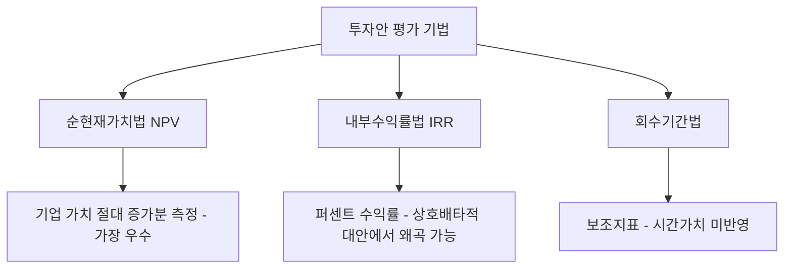

# 투자안 평가: 순현재가치(NPV)와 내부수익률(IRR)

## 1. 개요: 자본예산과 투자안 평가

- **자본예산(Capital Budgeting)**: 기업이 공장 신설, 신제품 개발 등 여러 투자 대안 중 기업 가치를 극대화하는 대안을 선택하는 의사결정 과정
- **투자안 평가 3대 기법**

| 기법 | 명칭 | 특징 |
|---|---|---|
| 1 | 순현재가치법 (NPV) | 교과서적으로 가장 우수한 기준 |
| 2 | 내부수익률법 (IRR) | 실무에서 자주 사용되나 함정 존재 |
| 3 | 회수기간법 (Payback Period) | 보조지표에 불과 |

---

## 2. 순현재가치법 (NPV)

### 2.1 정의
미래 모든 현금유입액을 자본비용(할인율)으로 할인하여 현재가치로 환산한 뒤, 초기 투자비용을 차감한 값

### 2.2 계산 공식

$$NPV = \sum_{t=1}^{n} \frac{CF_t}{(1+r)^t} - CF_0$$

| 기호 | 의미 |
|---|---|
| $CF_t$ | t시점의 기대 현금흐름 |
| $r$ | 할인율 (자본비용, 요구수익률) |
| $CF_0$ | 초기 투자비용 |

### 2.3 의사결정 기준

| NPV 값 | 의사결정 |
|---|---|
| $NPV > 0$ | 채택 (기업 부 증가) |
| $NPV < 0$ | 기각 (기업 부 감소) |

---

## 3. 내부수익률법 (IRR)

### 3.1 정의
$NPV$를 정확히 0으로 만드는 할인율

$$0 = \sum_{t=1}^{n} \frac{CF_t}{(1+IRR)^t} - CF_0$$

### 3.2 의사결정 기준

| 조건 | 의사결정 |
|---|---|
| $IRR > r$ (요구수익률) | 채택 |
| $IRR < r$ | 기각 |

### 3.3 장점
- 퍼센트(%) 수익률로 직관적 표현 가능 → 경영진 보고 시 이해도 높음 (예: "기대수익률 18%")

---

## 4. 상호배타적 투자안에서의 NPV-IRR 상충 (시험 단골 문제)

### 4.1 사례 (할인율 $r = 10\%$ 가정)

| 대안 | 초기투자 | 1년 후 현금흐름 | NPV | IRR |
|---|---|---|---|---|
| A | 1억 원 | 1.5억 원 | 3,600만 원 | 50% |
| B | 10억 원 | 13억 원 | 1억 8,000만 원 | 30% |

### 4.2 기준별 상반된 결론

- **IRR 기준**: A(50%) > B(30%) → A 선택
- **NPV 기준**: A(3,600만 원) < B(1.8억 원) → B 선택
- **투자 규모 차이**로 인해 IRR은 상대적 수익률만 보여주므로, 절대적 기업 가치 증가분(NPV)과 다른 결론을 낼 수 있음

---

## 5. 핵심 원칙 및 시험 함정 정리

| 구분 | 핵심 내용 |
|---|---|
| ① 왜곡 발생 조건 | 투자 규모 차이가 클 때 IRR은 왜곡된 판단을 유발 |
| ② 상충 시 우선순위 | NPV와 IRR 결과가 상충하면 **항상 NPV를 우선**한다 |
| ③ 재투자 수익률 가정 | NPV는 자본비용($r$)으로 재투자한다고 가정 (현실적) / IRR은 IRR 자체 수익률로 재투자한다고 가정 (비현실적, 과대평가 위험) |
| ④ 회수기간법의 한계 | 회수기간 이후 현금흐름 완전 무시 + 화폐의 시간가치(할인) 미반영 → 보조지표로만 활용 |

> **결론**: 독립적 투자안에서는 NPV와 IRR이 동일한 결론을 주지만, **상호배타적 투자안**에서는 반드시 **NPV를 기준**으로 최종 의사결정을 내려야 한다.